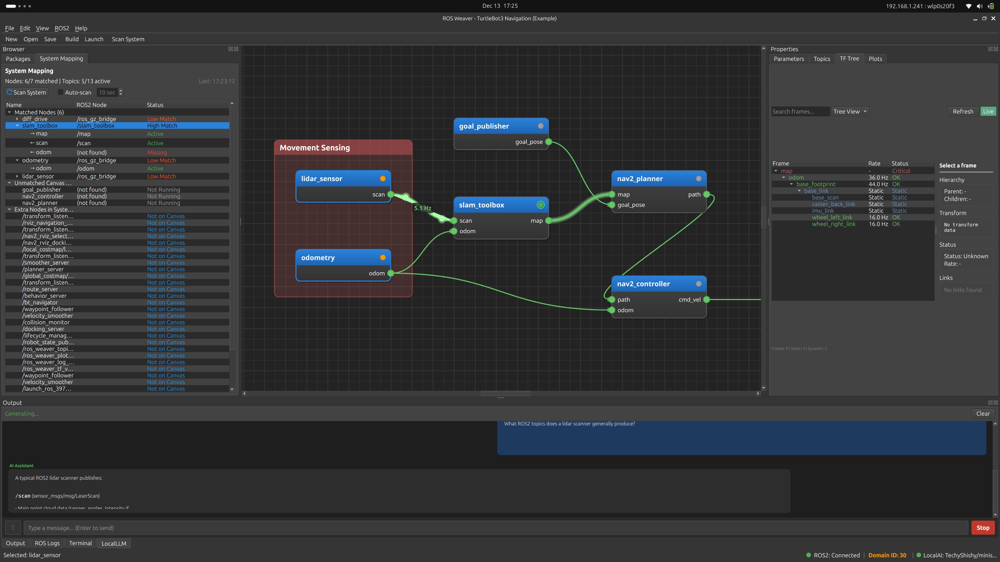

# ROS Weaver

<div align="right">

[](https://github.com/DingoOz/ROS2Weaver/actions/workflows/ci.yml)
[](https://github.com/DingoOz/ROS2Weaver/actions/workflows/ci.yml)
[](https://github.com/DingoOz/ROS2Weaver/actions/workflows/ci.yml)
[](https://github.com/DingoOz/ROS2Weaver/actions/workflows/ci.yml)

</div>

A visual tool for assembling, extending, and iterating on ROS2 packages and nodes.



## Quickstart

```bash
# Install dependencies (Ubuntu)
sudo apt install -y qtbase5-dev qtbase5-dev-tools libqt5widgets5 libyaml-cpp-dev \
  ros-${ROS_DISTRO}-tf2 ros-${ROS_DISTRO}-tf2-ros ros-${ROS_DISTRO}-tf2-msgs

# Source ROS2 and build
source /opt/ros/jazzy/setup.bash  # or your ROS2 distro
colcon build --packages-select ros_weaver
source install/setup.bash

# Run
ros2 run ros_weaver ros_weaver
```

## Overview

ROS Weaver provides a graphical interface for ROS2 development, allowing users to:
- Visually compose ROS2 packages and nodes using a drag-and-drop canvas
- Wire nodes together to define topic connections, services, and actions
- Monitor live ROS2 systems with real-time topic visualization
- Generate code and configuration files automatically
- Debug TF trees and frame relationships
- Preview and iterate on ROS2 systems without manual code editing

Inspired by visual programming tools like Unreal Engine's Blueprint and Houdini's node-based workflow.

## Features

### Visual Canvas Editor
- Drag-and-drop package blocks with type-safe connection wiring
- Animated connections showing live data flow rates
- Node grouping with resizable, colored comment boxes
- Zoom/pan navigation with middle mouse button

### Live ROS2 Monitoring
- Real-time topic viewer with message rates and echo output
- TF tree visualization with frame status and transform details
- System discovery scanning running nodes, topics, and services
- Canvas mapping to match discovered nodes with blocks

### Data Visualization
- Plot panel for real-time numeric data graphing
- Configurable plot styles and time windows
- Multi-topic overlay support

### Code Generation
- Package generation wizard with launch files and parameters
- YAML parameter export
- VS Code integration for generated packages

### Robot Configuration Wizard
Create complete robot description packages with ros2_control support:
- **Supported Robot Types**: Differential drive, 2-DOF arm (RRBot), 6-DOF industrial arm, Ackermann steering, tricycle, gripper, and custom configurations
- **8-Step Configuration**: Robot type selection, joint/wheel setup, hardware interfaces, controllers, sensors, teleop, visualization, and package generation
- **ros2_control Integration**: Pre-configured controllers for each robot type (diff_drive_controller, joint_trajectory_controller, etc.)
- **Sensor Configuration**: Add LiDAR, cameras, IMU, GPS with customizable parameters
- **Generated Package**: Complete ROS2 package with URDF/Xacro, controller configs, launch files, and RViz/Gazebo setup

### Local AI Assistant
- Ollama integration for local LLM support
- **Native tool calling** via Ollama's `/api/chat` endpoint for reliable canvas control
- AI chat panel for ROS2 development assistance
- Status indicator showing AI availability
- Customizable chat appearance (fonts, colors, styles)

The AI assistant can control the canvas through native function calling:
- Load example projects ("Load the turtlesim example")
- Add/remove ROS2 nodes ("Add a turtlesim node")
- Create connections between nodes
- Query project state ("What's on the canvas?")
- Set node parameters

Users can paste screenshots, use the Local AI to automatically analyse ROS logs, upload files, or chat to gain insights about the current project. All processing happens locally without sending data to the cloud.

**Recommended models for tool calling:** `llama3.1:8b`, `qwen2.5:7b`, `qwen2.5-coder:7b`

### In-Program Help
- Interactive guided tour for new users
- Searchable user manual and documentation
- Keyboard shortcuts reference (F1)
- Context-sensitive help

### Example Projects
- Turtlesim Teleop - Basic publisher/subscriber
- TurtleBot3 Navigation - SLAM and Nav2 with Gazebo

## Requirements

- ROS2 (Humble, Iron, or Jazzy)
- Qt5 (Widgets, Gui, Core)
- CMake 3.8+
- C++17 compatible compiler
- yaml-cpp
- TF2 libraries

### Installing Dependencies (Ubuntu)

```bash
sudo apt update
sudo apt install -y \
  qtbase5-dev \
  libqt5widgets5 \
  libyaml-cpp-dev \
  ros-${ROS_DISTRO}-rclcpp \
  ros-${ROS_DISTRO}-std-msgs \
  ros-${ROS_DISTRO}-rcl-interfaces \
  ros-${ROS_DISTRO}-tf2 \
  ros-${ROS_DISTRO}-tf2-ros \
  ros-${ROS_DISTRO}-tf2-msgs \
  ros-${ROS_DISTRO}-geometry-msgs
```

## Building

```bash
# Source ROS2 environment
source /opt/ros/${ROS_DISTRO}/setup.bash

# Navigate to workspace root (parent of src)
cd /path/to/ROS2Weaver

# Build with colcon
colcon build --packages-select ros_weaver

# Source the workspace
source install/setup.bash
```

## Running

```bash
ros2 run ros_weaver ros_weaver
```

## Usage

### Canvas Navigation
| Action | Control |
|--------|---------|
| Pan canvas | Middle Mouse Button drag |
| Zoom | Ctrl + Scroll |
| Add nodes | Right Click on canvas |
| Edit/delete block | Right Click on block |
| Delete selected | Delete / Backspace |
| Expand/collapse | Double Click on block |

### Creating Connections
- Drag from an output pin to an input pin to create a topic connection
- Connections are automatically styled based on data type (Topic, Service, Action)
- Live connections animate based on message rate when monitoring is enabled

### Keyboard Shortcuts
| Shortcut | Action |
|----------|--------|
| Ctrl+N | New Project |
| Ctrl+O | Open Project |
| Ctrl+S | Save Project |
| Ctrl+Shift+S | Save As |
| Ctrl+G | Generate Code |
| Ctrl+R | Robot Configuration Wizard |
| Ctrl+M | Toggle Live Monitoring |
| Ctrl+Shift+R | Scan System |
| Ctrl+Shift+M | Show System Mapping |
| Ctrl+Shift+T | Show Topic Viewer |
| Ctrl+Shift+L | Show ROS Logs |
| F1 | Keyboard Shortcuts |
| F2 | Start Guided Tour |

### Package Browser
- Drag packages from the left panel onto the canvas
- Search for ROS2 packages by name
- Browse workspace packages, system packages, and templates

### Live Monitoring
1. Click the **Live** button in the Topic Viewer or press Ctrl+M
2. Click the **Canvas** button to auto-subscribe to topics matching your canvas
3. Connection lines will animate based on data flow rate

### TF Tree Viewer
1. Open via ROS2 > Show TF Tree (Ctrl+T)
2. Click the **Live** button to start listening to /tf and /tf_static
3. Select frames to see details and links to canvas blocks

## Project Structure

```
src/ros_weaver/
├── CMakeLists.txt
├── package.xml
├── examples/                    # Example projects
│   ├── turtlesim_teleop/
│   └── turtlebot3_navigation/
├── include/ros_weaver/
│   ├── main_window.hpp
│   ├── canvas/
│   │   ├── weaver_canvas.hpp
│   │   ├── package_block.hpp
│   │   ├── connection_line.hpp
│   │   └── node_group.hpp
│   ├── core/
│   │   ├── code_generator.hpp
│   │   ├── project.hpp
│   │   ├── system_discovery.hpp
│   │   └── topic_monitor.hpp
│   ├── widgets/
│   │   ├── output_panel.hpp
│   │   ├── param_dashboard.hpp
│   │   ├── tf_tree_panel.hpp
│   │   └── topic_viewer_panel.hpp
│   └── wizards/
│       ├── package_wizard.hpp
│       └── robot_wizard.hpp
└── src/
    ├── main.cpp
    ├── main_window.cpp
    ├── canvas/
    ├── core/
    ├── widgets/
    └── wizards/
```

## License

GPL-3.0
