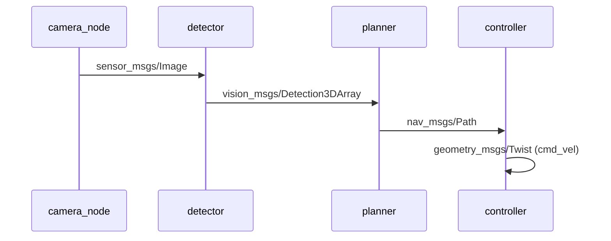
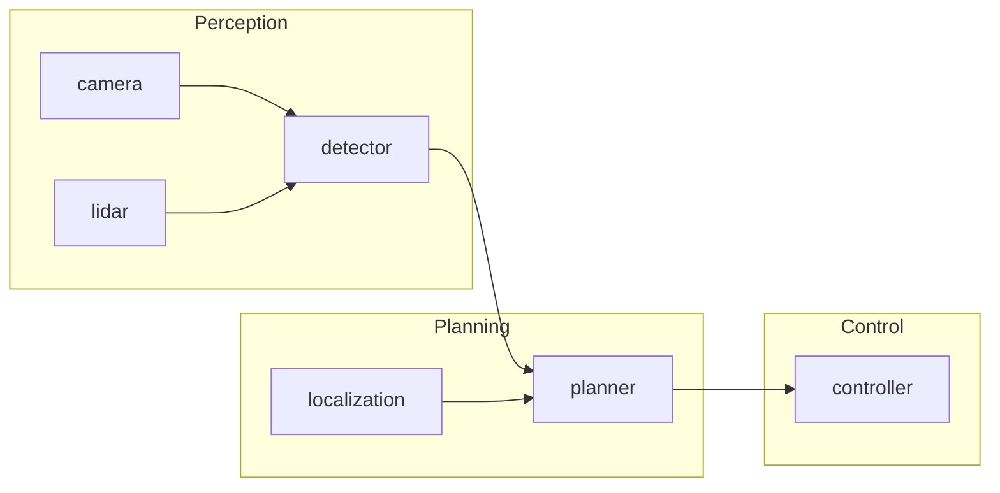
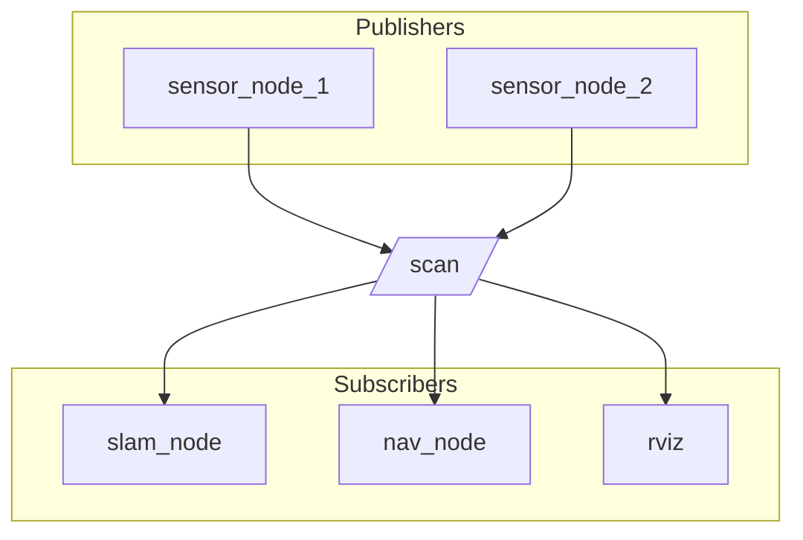
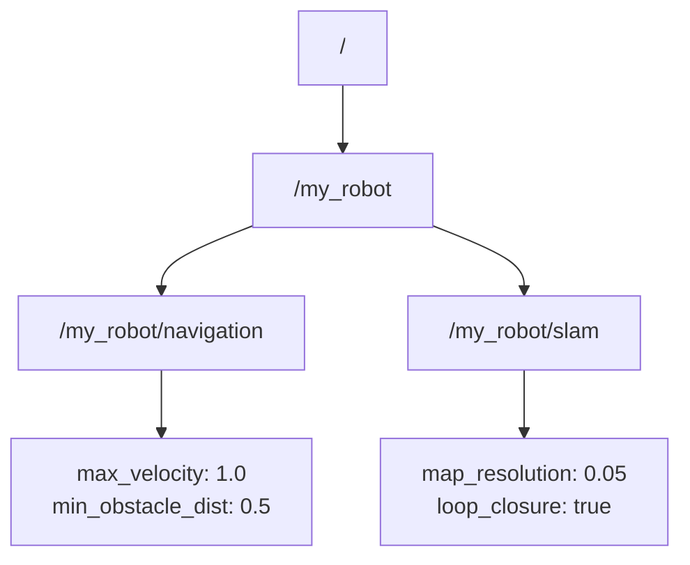

# ROS2Weaver Feature Ideas & Roadmap

These are community and AI-suggested features to enhance ROS2Weaver, prioritized by potential impact and feasibility. Contributions are welcome!

## Implementation Status

### Completed Features (v1.1.0)

| Feature | Status | Notes |
|---------|--------|-------|
| Context-Sensitive Help | ✅ Done | F1 key, help browser, context tooltips |
| Inline Tooltips & Schema Viewer | ✅ Done | Message schema viewer panel |
| README Preview Panel | ✅ Done | Dockable panel for package docs |
| Export to PlantUML/Mermaid/Graphviz | ✅ Done | File → Export menu |
| Import from rqt_graph DOT | ✅ Done | File → Import menu |
| Import from CARET YAML | ✅ Done | File → Import menu |
| Project Save/Load (.weaver) | ✅ Done | JSON/YAML project files |
| One-click Gazebo/Ignition Launch | ✅ Done | Simulation menu |
| Rosbag Recording/Playback | ✅ Done | Rosbag Workbench panel |
| Static Analysis | ✅ Done | Tools → Run Analysis |
| Parameter Dashboard | ✅ Done | Properties panel |
| Undo/Redo Stack | ✅ Done | Edit menu, Ctrl+Z/Y |
| Architecture Diff View | ✅ Done | Compare project versions |
| Multi-canvas Tabs | ✅ Done | Tab-based canvas management |
| Canvas Grid Visualization | ✅ Done | View menu, snap-to-grid |
| Mini-map Navigation | ✅ Done | Dockable minimap panel |
| Auto-layout Algorithms | ✅ Done | Hierarchical, force-directed, circular, grid |
| Canvas Annotations | ✅ Done | Right-click → Add Annotation |
| Connection Bandwidth Visualization | ✅ Done | Live message rates on connections |
| Time-synced Playback | ✅ Done | Canvas highlights during bag playback |
| Node Health Dashboard | ✅ Done | CPU, memory, latency monitoring |
| QoS Profile Editor | ✅ Done | Visual QoS configuration |
| Launch File Generator | ✅ Done | Code generation wizard |
| Parameter Presets | ✅ Done | Save/load parameter configurations |
| Node Templates Library | ✅ Done | Pre-built node patterns |
| Workspace Browser Panel | ✅ Done | Browse ROS2 workspace packages |
| Natural Language Architecture Generation | ✅ Done | AI-powered architecture from description |
| Automated Error Fixing Suggestions | ✅ Done | AI suggestions via "Ask AI" button |
| Architecture Optimization Recommendations | ✅ Done | Tools → Optimize Architecture |
| Advanced Node Library Search | ✅ Done | Search tab with filters |
| Improved Namespace/Remapping Visualization | ✅ Done | Visual namespace badges and remapping indicators |

### Completed Features (v1.2.0)

| Feature | Status | Notes |
|---------|--------|-------|
| Live Message Inspector & Publisher | Done | View live messages, publish test messages |
| Node Lifecycle State Visualization | Done | Visual state machine, transition controls |
| Remote Robot Connection | Done | SSH tunnel, DDS configuration, profile management |

### Completed Features (v1.3.0)

| Feature | Status | Notes |
|---------|--------|-------|
| Topic Latency Heatmap | Done | Color-coded latency visualization, auto-tune thresholds, historical graph, CSV export |
| Test Message Scenario Editor | Done | Create/replay test message sequences, pytest export, recording from live system |

### Completed Features (v1.4.0)

| Feature | Status | Notes |
|---------|--------|-------|
| Architecture Documentation Generator | Done | Markdown/HTML/PDF export, Mermaid/PlantUML diagrams, configurable sections |

### Completed Features (v1.5.0)

| Feature | Status | Notes |
|---------|--------|-------|
| ros2 doctor Integration | Done | Built-in diagnostics panel with environment, network, DDS, and node health checks |

### Completed Features (v1.6.0)

| Feature | Status | Notes |
|---------|--------|-------|
| DDS Network Topology View | Done | Graph and table views, host clustering, discovery type detection, bidirectional canvas integration |

### Completed Features (v1.7.0)

| Feature | Status | Notes |
|---------|--------|-------|
| Visual Behavior Tree Editor | Done | Load and visualize BehaviorTree.CPP XML files, node-based tree display |
| ROS Mission Planner | Done | Visual waypoint planning with map import, Nav2 export, scale calibration, behavior triggers |

### Remaining Features

| Feature | Priority | Complexity |
|---------|----------|------------|
| Google Maps Integration for Mission Planner | High | Medium |
| Enhanced Architecture Documentation | High | Medium |
| Message Schema Diff Tool | Medium | Low |
| Plugin/Extension System | Low | High |
| CI/CD Pipeline Generator | Low | Medium |
| Embedded mini-RViz / 3D view | Low | High |
| Multi-user collaboration | Low | High |
| URDF Viewer and Modifier | Medium | High |

---

## Contributing Guidelines

### Branch Naming Convention
When implementing a feature from this roadmap, create a new branch using the following convention:

```bash
git checkout -b feature/<feature-name>
```

Examples:
- `feature/mini-rviz-view`
- `feature/ai-architecture-generation`
- `feature/multi-user-collab`

### Workflow
1. Create a new branch from `main` for each feature.
2. Implement the feature with appropriate tests.
3. Submit a pull request back to `main`.
4. Reference the relevant roadmap item in the PR description.

This keeps features isolated and makes code review easier.

---

## Feature Details

### Remaining: Embedded mini-RViz / 3D View
- Overlay live robot model and TF data
- Visualize sensor data in 3D
- Integration with existing TF Tree panel
- Would require significant Qt3D or RViz library integration

### Remaining: Multi-user Collaboration
- Real-time collaborative editing
- Presence indicators
- Conflict resolution
- Would require WebSocket server infrastructure

### Remaining: URDF Viewer and Modifier
- Load and visualize URDF files in 3D with joint axis orientation indicators (RViz-style RGB coloring)
- Blender-style camera controls (orbit, pan, zoom)
- Synchronized tree view of URDF joints with 3D selection
- Multi-select support for joints in both views
- Joint orientation editing with 90-degree snap (default) or free rotation mode
- Real-time model updates reflecting joint orientation changes
- Configurable rendering: wireframe, basic shading, full lighting with shadows
- Customizable view background colors
- Would require Qt3D integration for 3D rendering

---

## Detailed Implementation Plans for New Features

### HIGH PRIORITY

---

### Live Message Inspector & Publisher

**Branch:** `feature/live-message-inspector`

**Overview:** A dockable panel that allows users to inspect live messages on any topic and publish custom messages for testing.

#### New Files to Create

```
src/ros_weaver/include/ros_weaver/widgets/message_inspector_panel.hpp
src/ros_weaver/src/widgets/message_inspector_panel.cpp
src/ros_weaver/include/ros_weaver/core/generic_message_handler.hpp
src/ros_weaver/src/core/generic_message_handler.cpp
src/ros_weaver/include/ros_weaver/widgets/message_editor_widget.hpp
src/ros_weaver/src/widgets/message_editor_widget.cpp
```

#### Implementation Steps

**Step 1: Create GenericMessageHandler class**

File: `src/ros_weaver/include/ros_weaver/core/generic_message_handler.hpp`

```cpp
class GenericMessageHandler : public QObject {
  Q_OBJECT
public:
  explicit GenericMessageHandler(rclcpp::Node::SharedPtr node);

  // Subscribe to any topic dynamically
  void subscribeToTopic(const QString& topicName, const QString& messageType);
  void unsubscribeFromTopic(const QString& topicName);

  // Publish to any topic
  void publishMessage(const QString& topicName, const QString& messageType,
                      const QJsonObject& messageData);

  // Get message type info
  QJsonObject getMessageSchema(const QString& messageType);

signals:
  void messageReceived(const QString& topicName, const QJsonObject& message,
                       qint64 timestamp);
  void subscriptionError(const QString& topicName, const QString& error);

private:
  rclcpp::Node::SharedPtr node_;
  QMap<QString, rclcpp::GenericSubscription::SharedPtr> subscriptions_;
  QMap<QString, rclcpp::GenericPublisher::SharedPtr> publishers_;

  // Use rosidl_typesupport for dynamic message handling
  QJsonObject deserializeMessage(const rclcpp::SerializedMessage& msg,
                                  const QString& messageType);
  rclcpp::SerializedMessage serializeMessage(const QJsonObject& json,
                                              const QString& messageType);
};
```

**Step 2: Create MessageInspectorPanel widget**

File: `src/ros_weaver/include/ros_weaver/widgets/message_inspector_panel.hpp`

```cpp
class MessageInspectorPanel : public QWidget {
  Q_OBJECT
public:
  explicit MessageInspectorPanel(QWidget* parent = nullptr);

  void setRosNode(rclcpp::Node::SharedPtr node);

public slots:
  void inspectTopic(const QString& topicName, const QString& messageType);
  void stopInspecting();

private:
  void setupUi();
  void setupConnections();

  // UI Components
  QComboBox* topicSelector_;           // Dropdown of available topics
  QPushButton* refreshTopicsButton_;
  QTreeWidget* messageTreeView_;       // Expandable message fields
  QSpinBox* bufferSizeSpinBox_;        // Keep last N messages
  QListWidget* messageHistoryList_;    // Clickable history
  QPushButton* pauseButton_;
  QPushButton* clearButton_;
  QLabel* rateLabel_;                  // Current message rate
  QLabel* lastReceivedLabel_;          // Timestamp of last message

  // Publisher section
  QGroupBox* publisherGroup_;
  QTextEdit* jsonEditor_;              // JSON message editor
  QPushButton* publishButton_;
  QPushButton* loadSchemaButton_;      // Load default schema

  // State
  GenericMessageHandler* messageHandler_;
  QList<QPair<qint64, QJsonObject>> messageBuffer_;
  int maxBufferSize_ = 100;
  bool isPaused_ = false;

private slots:
  void onTopicSelected(int index);
  void onMessageReceived(const QString& topic, const QJsonObject& msg, qint64 ts);
  void onPublishClicked();
  void populateTopicList();
};
```

**Step 3: Implement message tree visualization**

Create a recursive function to display nested message fields:

```cpp
void MessageInspectorPanel::populateTreeFromJson(QTreeWidgetItem* parent,
                                                   const QJsonObject& obj) {
  for (auto it = obj.begin(); it != obj.end(); ++it) {
    QTreeWidgetItem* item = new QTreeWidgetItem();
    item->setText(0, it.key());  // Field name

    if (it.value().isObject()) {
      item->setText(1, "{...}");
      populateTreeFromJson(item, it.value().toObject());
    } else if (it.value().isArray()) {
      QJsonArray arr = it.value().toArray();
      item->setText(1, QString("[%1 items]").arg(arr.size()));
      // Add array items as children
      for (int i = 0; i < arr.size(); ++i) {
        QTreeWidgetItem* arrItem = new QTreeWidgetItem();
        arrItem->setText(0, QString("[%1]").arg(i));
        if (arr[i].isObject()) {
          populateTreeFromJson(arrItem, arr[i].toObject());
        } else {
          arrItem->setText(1, arr[i].toVariant().toString());
        }
        item->addChild(arrItem);
      }
    } else {
      item->setText(1, it.value().toVariant().toString());
      item->setText(2, getJsonTypeName(it.value()));  // Type column
    }

    if (parent) {
      parent->addChild(item);
    } else {
      messageTreeView_->addTopLevelItem(item);
    }
  }
}
```

**Step 4: Add JSON message editor with schema validation**

```cpp
void MessageInspectorPanel::onLoadSchemaClicked() {
  QString messageType = getCurrentMessageType();
  QJsonObject schema = messageHandler_->getMessageSchema(messageType);

  // Generate template JSON from schema
  QJsonObject template_ = generateTemplateFromSchema(schema);

  // Pretty print to editor
  QJsonDocument doc(template_);
  jsonEditor_->setPlainText(doc.toJson(QJsonDocument::Indented));
}

void MessageInspectorPanel::onPublishClicked() {
  QString json = jsonEditor_->toPlainText();
  QJsonParseError error;
  QJsonDocument doc = QJsonDocument::fromJson(json.toUtf8(), &error);

  if (error.error != QJsonParseError::NoError) {
    QMessageBox::warning(this, tr("Invalid JSON"),
                         tr("Parse error: %1").arg(error.errorString()));
    return;
  }

  QString topic = topicSelector_->currentData().toString();
  QString msgType = topicSelector_->currentData(Qt::UserRole + 1).toString();

  messageHandler_->publishMessage(topic, msgType, doc.object());
}
```

**Step 5: Integration with MainWindow**

In `main_window.cpp`:

```cpp
void MainWindow::createMessageInspectorPanel() {
  messageInspectorPanel_ = new MessageInspectorPanel(this);
  messageInspectorDock_ = new QDockWidget(tr("Message Inspector"), this);
  messageInspectorDock_->setWidget(messageInspectorPanel_);
  addDockWidget(Qt::RightDockWidgetArea, messageInspectorDock_);

  // Connect to canvas selection
  connect(canvas_, &WeaverCanvas::connectionSelected,
          this, [this](ConnectionLine* conn) {
    if (conn && !conn->topicName().isEmpty()) {
      messageInspectorPanel_->inspectTopic(conn->topicName(),
                                            conn->messageType());
    }
  });
}
```

**Step 6: Add to CMakeLists.txt**

```cmake
set(WIDGET_SOURCES
  # ... existing sources ...
  src/widgets/message_inspector_panel.cpp
  src/widgets/message_editor_widget.cpp
)

set(CORE_SOURCES
  # ... existing sources ...
  src/core/generic_message_handler.cpp
)
```

#### Testing

Create test file `test/test_message_inspector.cpp`:

```cpp
TEST(MessageInspectorTest, JsonSerialization) {
  // Test message serialization/deserialization
}

TEST(MessageInspectorTest, SchemaGeneration) {
  // Test schema generation for common message types
}

TEST(MessageInspectorTest, BufferManagement) {
  // Test message buffer with size limits
}
```

---

### Node Lifecycle State Visualization

**Branch:** `feature/lifecycle-visualization`

**Overview:** Visual representation of ROS2 lifecycle node states with interactive state transition controls.

#### New Files to Create

```
src/ros_weaver/include/ros_weaver/widgets/lifecycle_state_widget.hpp
src/ros_weaver/src/widgets/lifecycle_state_widget.cpp
src/ros_weaver/include/ros_weaver/core/lifecycle_manager.hpp
src/ros_weaver/src/core/lifecycle_manager.cpp
```

#### Implementation Steps

**Step 1: Create LifecycleManager class**

File: `src/ros_weaver/include/ros_weaver/core/lifecycle_manager.hpp`

```cpp
#include <lifecycle_msgs/srv/change_state.hpp>
#include <lifecycle_msgs/srv/get_state.hpp>
#include <lifecycle_msgs/msg/transition_event.hpp>

enum class LifecycleState {
  Unknown = 0,
  Unconfigured = 1,
  Inactive = 2,
  Active = 3,
  Finalized = 4,
  // Transitioning states
  Configuring = 10,
  CleaningUp = 11,
  ShuttingDown = 12,
  Activating = 13,
  Deactivating = 14,
  ErrorProcessing = 15
};

struct LifecycleNodeInfo {
  QString nodeName;
  LifecycleState currentState;
  QDateTime lastStateChange;
  QStringList availableTransitions;
};

class LifecycleManager : public QObject {
  Q_OBJECT
public:
  explicit LifecycleManager(rclcpp::Node::SharedPtr node);

  // Query lifecycle nodes
  QStringList discoverLifecycleNodes();
  LifecycleState getNodeState(const QString& nodeName);
  QStringList getAvailableTransitions(const QString& nodeName);

  // Trigger transitions
  void requestTransition(const QString& nodeName, const QString& transition);

  // Batch operations
  void configureAll(const QStringList& nodes);
  void activateAll(const QStringList& nodes);
  void deactivateAll(const QStringList& nodes);

signals:
  void stateChanged(const QString& nodeName, LifecycleState newState);
  void transitionFailed(const QString& nodeName, const QString& error);
  void lifecycleNodesDiscovered(const QStringList& nodes);

private:
  rclcpp::Node::SharedPtr node_;
  QMap<QString, rclcpp::Client<lifecycle_msgs::srv::ChangeState>::SharedPtr> changeStateClients_;
  QMap<QString, rclcpp::Client<lifecycle_msgs::srv::GetState>::SharedPtr> getStateClients_;
  QMap<QString, rclcpp::Subscription<lifecycle_msgs::msg::TransitionEvent>::SharedPtr> transitionSubs_;

  void subscribeToTransitionEvents(const QString& nodeName);
};
```

**Step 2: Create LifecycleStateWidget for visual display**

File: `src/ros_weaver/include/ros_weaver/widgets/lifecycle_state_widget.hpp`

```cpp
class LifecycleStateWidget : public QWidget {
  Q_OBJECT
public:
  explicit LifecycleStateWidget(QWidget* parent = nullptr);

  void setLifecycleManager(LifecycleManager* manager);
  void setNodeName(const QString& nodeName);

protected:
  void paintEvent(QPaintEvent* event) override;

private:
  void setupUi();
  void drawStateMachine(QPainter* painter);
  void updateButtonStates();

  // State machine visualization
  struct StateNode {
    QString name;
    QRectF rect;
    QColor color;
    bool isCurrent;
  };
  QList<StateNode> stateNodes_;

  // UI
  QLabel* nodeNameLabel_;
  QLabel* currentStateLabel_;
  QPushButton* configureButton_;
  QPushButton* activateButton_;
  QPushButton* deactivateButton_;
  QPushButton* cleanupButton_;
  QPushButton* shutdownButton_;
  QLabel* historyLabel_;

  LifecycleManager* manager_;
  QString currentNodeName_;
  LifecycleState currentState_;

private slots:
  void onConfigureClicked();
  void onActivateClicked();
  void onDeactivateClicked();
  void onStateChanged(const QString& nodeName, LifecycleState state);
};
```

**Step 3: Draw state machine diagram**

```cpp
void LifecycleStateWidget::drawStateMachine(QPainter* painter) {
  painter->setRenderHint(QPainter::Antialiasing);

  // Define state positions (horizontal layout)
  QMap<LifecycleState, QPointF> statePositions = {
    {LifecycleState::Unconfigured, QPointF(50, 100)},
    {LifecycleState::Inactive, QPointF(200, 100)},
    {LifecycleState::Active, QPointF(350, 100)},
    {LifecycleState::Finalized, QPointF(200, 200)}
  };

  QMap<LifecycleState, QColor> stateColors = {
    {LifecycleState::Unconfigured, QColor(150, 150, 150)},  // Gray
    {LifecycleState::Inactive, QColor(255, 200, 50)},       // Yellow
    {LifecycleState::Active, QColor(100, 200, 100)},        // Green
    {LifecycleState::Finalized, QColor(200, 100, 100)}      // Red
  };

  // Draw transitions (arrows)
  painter->setPen(QPen(QColor(100, 100, 100), 2));
  drawArrow(painter, statePositions[LifecycleState::Unconfigured],
            statePositions[LifecycleState::Inactive], "configure");
  drawArrow(painter, statePositions[LifecycleState::Inactive],
            statePositions[LifecycleState::Active], "activate");
  // ... more transitions

  // Draw state circles
  for (auto it = statePositions.begin(); it != statePositions.end(); ++it) {
    QColor color = stateColors[it.key()];
    bool isCurrent = (it.key() == currentState_);

    // Highlight current state
    if (isCurrent) {
      painter->setBrush(color);
      painter->setPen(QPen(color.darker(120), 3));
    } else {
      painter->setBrush(color.lighter(150));
      painter->setPen(QPen(color, 1));
    }

    QRectF rect(it.value().x() - 30, it.value().y() - 30, 60, 60);
    painter->drawEllipse(rect);

    // Draw state name
    painter->setPen(Qt::black);
    painter->drawText(rect, Qt::AlignCenter, lifecycleStateToString(it.key()));
  }
}
```

**Step 4: Add lifecycle badge to PackageBlock**

Modify `package_block.cpp` to show lifecycle state:

```cpp
void PackageBlock::paintLifecycleBadge(QPainter* painter) {
  if (!isLifecycleNode_ || lifecycleState_ == LifecycleState::Unknown) {
    return;
  }

  // Draw badge in top-right corner
  QRectF badgeRect(BLOCK_WIDTH - 24, 4, 20, 20);

  QColor stateColor;
  QString stateChar;
  switch (lifecycleState_) {
    case LifecycleState::Unconfigured:
      stateColor = QColor(150, 150, 150);
      stateChar = "U";
      break;
    case LifecycleState::Inactive:
      stateColor = QColor(255, 200, 50);
      stateChar = "I";
      break;
    case LifecycleState::Active:
      stateColor = QColor(100, 200, 100);
      stateChar = "A";
      break;
    case LifecycleState::Finalized:
      stateColor = QColor(200, 100, 100);
      stateChar = "F";
      break;
    default:
      stateColor = QColor(100, 100, 100);
      stateChar = "?";
  }

  painter->setBrush(stateColor);
  painter->setPen(Qt::NoPen);
  painter->drawEllipse(badgeRect);

  painter->setPen(Qt::white);
  painter->setFont(QFont("Sans", 10, QFont::Bold));
  painter->drawText(badgeRect, Qt::AlignCenter, stateChar);
}
```

**Step 5: Add context menu for lifecycle transitions**

In `weaver_canvas.cpp`:

```cpp
void WeaverCanvas::showBlockContextMenu(PackageBlock* block, const QPoint& pos) {
  QMenu menu;

  // ... existing menu items ...

  if (block->isLifecycleNode()) {
    QMenu* lifecycleMenu = menu.addMenu(tr("Lifecycle"));

    QAction* configureAction = lifecycleMenu->addAction(tr("Configure"));
    QAction* activateAction = lifecycleMenu->addAction(tr("Activate"));
    QAction* deactivateAction = lifecycleMenu->addAction(tr("Deactivate"));
    QAction* cleanupAction = lifecycleMenu->addAction(tr("Cleanup"));
    QAction* shutdownAction = lifecycleMenu->addAction(tr("Shutdown"));

    // Enable/disable based on current state
    LifecycleState state = block->lifecycleState();
    configureAction->setEnabled(state == LifecycleState::Unconfigured);
    activateAction->setEnabled(state == LifecycleState::Inactive);
    deactivateAction->setEnabled(state == LifecycleState::Active);
    cleanupAction->setEnabled(state == LifecycleState::Inactive);

    connect(configureAction, &QAction::triggered, [this, block]() {
      lifecycleManager_->requestTransition(block->nodeName(), "configure");
    });
    // ... connect other actions
  }

  menu.exec(pos);
}
```

---

### Remote Robot Connection

**Branch:** `feature/remote-connection`

**Overview:** Connect to ROS2 systems running on remote machines over network or SSH tunnel.

#### New Files to Create

```
src/ros_weaver/include/ros_weaver/core/remote_connection_manager.hpp
src/ros_weaver/src/core/remote_connection_manager.cpp
src/ros_weaver/include/ros_weaver/widgets/remote_connection_dialog.hpp
src/ros_weaver/src/widgets/remote_connection_dialog.cpp
src/ros_weaver/include/ros_weaver/core/ssh_tunnel.hpp
src/ros_weaver/src/core/ssh_tunnel.cpp
```

#### Implementation Steps

**Step 1: Create RemoteConnectionManager**

```cpp
struct RobotProfile {
  QString name;
  QString hostname;
  int port = 22;
  QString username;
  QString sshKeyPath;
  int rosDomainId = 0;
  QString rosDistro;
  bool useSshTunnel = true;
  QStringList environmentVariables;
};

class RemoteConnectionManager : public QObject {
  Q_OBJECT
public:
  explicit RemoteConnectionManager(QObject* parent = nullptr);

  // Profile management
  void saveProfile(const RobotProfile& profile);
  void deleteProfile(const QString& name);
  QList<RobotProfile> loadProfiles();

  // Connection
  void connectToRobot(const RobotProfile& profile);
  void disconnect();
  bool isConnected() const;

  // Discovery
  QStringList discoverRemoteTopics();
  QStringList discoverRemoteNodes();
  QStringList discoverRemoteServices();

signals:
  void connectionEstablished(const QString& robotName);
  void connectionFailed(const QString& error);
  void connectionLost();
  void discoveryComplete(const QStringList& topics, const QStringList& nodes);

private:
  SshTunnel* sshTunnel_;
  RobotProfile currentProfile_;
  bool connected_ = false;

  void setupDdsEnvironment(const RobotProfile& profile);
  void startDiscovery();
};
```

**Step 2: Create SSH Tunnel wrapper**

```cpp
class SshTunnel : public QObject {
  Q_OBJECT
public:
  explicit SshTunnel(QObject* parent = nullptr);
  ~SshTunnel();

  void establish(const QString& host, int port, const QString& user,
                 const QString& keyPath, int localPort, int remotePort);
  void close();
  bool isActive() const;

signals:
  void tunnelEstablished(int localPort);
  void tunnelError(const QString& error);
  void tunnelClosed();

private:
  QProcess* sshProcess_;
  int localPort_;

  QString buildSshCommand(const QString& host, int port, const QString& user,
                          const QString& keyPath, int localPort, int remotePort);
};
```

**Step 3: Create connection dialog UI**

```cpp
class RemoteConnectionDialog : public QDialog {
  Q_OBJECT
public:
  explicit RemoteConnectionDialog(QWidget* parent = nullptr);

  RobotProfile getProfile() const;

private:
  void setupUi();
  void loadProfiles();
  void testConnection();

  // Profile selection
  QComboBox* profileCombo_;
  QPushButton* newProfileButton_;
  QPushButton* deleteProfileButton_;

  // Connection details
  QLineEdit* hostnameEdit_;
  QSpinBox* portSpinBox_;
  QLineEdit* usernameEdit_;
  QLineEdit* sshKeyEdit_;
  QPushButton* browseKeyButton_;

  // ROS settings
  QSpinBox* domainIdSpinBox_;
  QComboBox* distroCombo_;
  QCheckBox* useTunnelCheckbox_;

  // Environment
  QTableWidget* envTable_;

  // Actions
  QPushButton* testButton_;
  QPushButton* connectButton_;
  QPushButton* cancelButton_;

  QLabel* statusLabel_;

  RemoteConnectionManager* manager_;
};
```

**Step 4: DDS configuration for remote discovery**

```cpp
void RemoteConnectionManager::setupDdsEnvironment(const RobotProfile& profile) {
  // Set ROS_DOMAIN_ID
  qputenv("ROS_DOMAIN_ID", QString::number(profile.rosDomainId).toUtf8());

  // For Fast-DDS, configure discovery servers
  // Create XML configuration for unicast discovery to remote host
  QString xmlConfig = generateFastDdsConfig(profile.hostname);
  QString configPath = QDir::temp().filePath("ros_weaver_dds_config.xml");

  QFile file(configPath);
  if (file.open(QIODevice::WriteOnly)) {
    file.write(xmlConfig.toUtf8());
    file.close();
  }

  qputenv("FASTRTPS_DEFAULT_PROFILES_FILE", configPath.toUtf8());

  // Set custom environment variables
  for (const QString& envVar : profile.environmentVariables) {
    QStringList parts = envVar.split('=');
    if (parts.size() == 2) {
      qputenv(parts[0].toUtf8(), parts[1].toUtf8());
    }
  }
}

QString RemoteConnectionManager::generateFastDdsConfig(const QString& remoteHost) {
  return QString(R"(
<?xml version="1.0" encoding="UTF-8"?>
<profiles xmlns="http://www.eprosima.com/XMLSchemas/fastRTPS_Profiles">
  <participant profile_name="ros_weaver_remote" is_default_profile="true">
    <rtps>
      <builtin>
        <discovery_config>
          <discoveryProtocol>SIMPLE</discoveryProtocol>
          <initialPeersList>
            <locator>
              <udpv4>
                <address>%1</address>
              </udpv4>
            </locator>
          </initialPeersList>
        </discovery_config>
      </builtin>
    </rtps>
  </participant>
</profiles>
)").arg(remoteHost);
}
```

**Step 5: Add to MainWindow menu**

```cpp
void MainWindow::setupConnectionMenu() {
  QMenu* connectionMenu = menuBar()->addMenu(tr("&Connection"));

  QAction* connectAction = connectionMenu->addAction(tr("Connect to Robot..."));
  connectAction->setShortcut(QKeySequence(Qt::CTRL | Qt::Key_R));
  connect(connectAction, &QAction::triggered, this, &MainWindow::showRemoteConnectionDialog);

  QAction* disconnectAction = connectionMenu->addAction(tr("Disconnect"));
  disconnectAction->setEnabled(false);
  connect(disconnectAction, &QAction::triggered, remoteManager_, &RemoteConnectionManager::disconnect);

  connectionMenu->addSeparator();

  // Recent connections submenu
  recentConnectionsMenu_ = connectionMenu->addMenu(tr("Recent Connections"));
  updateRecentConnectionsMenu();
}
```

---

### MEDIUM PRIORITY

---

### Topic Latency Heatmap

**Branch:** `feature/latency-heatmap`

**Overview:** Visualize end-to-end message latency through node chains with color-coded overlays.

#### Implementation Steps

**Step 1: Create LatencyTracker class**

```cpp
struct LatencyMeasurement {
  QString sourceTopic;
  QString targetTopic;
  double latencyMs;
  qint64 timestamp;
};

class LatencyTracker : public QObject {
  Q_OBJECT
public:
  // Track latency by matching message timestamps across topics
  void trackLatency(const QString& inputTopic, const QString& outputTopic,
                    const QString& correlationField);

  // Get statistics
  double getAverageLatency(const QString& connection) const;
  double getP99Latency(const QString& connection) const;
  QList<LatencyMeasurement> getHistory(const QString& connection, int maxSize = 100);

signals:
  void latencyUpdated(const QString& connection, double latencyMs);
  void latencyAlert(const QString& connection, double latencyMs, double threshold);

private:
  // Track pending messages waiting for correlation
  QMap<QString, QList<QPair<qint64, QVariant>>> pendingCorrelations_;
  // Latency history per connection
  QMap<QString, QList<double>> latencyHistory_;
};
```

**Step 2: Add heatmap visualization to ConnectionLine**

```cpp
void ConnectionLine::setLatencyHeatmapEnabled(bool enabled) {
  showLatencyHeatmap_ = enabled;
  update();
}

void ConnectionLine::setLatency(double latencyMs) {
  currentLatency_ = latencyMs;
  update();
}

QColor ConnectionLine::getLatencyColor(double latencyMs) const {
  // Color scale: green (< 10ms) -> yellow (10-50ms) -> red (> 50ms)
  if (latencyMs < 10.0) {
    return QColor(100, 200, 100);  // Green
  } else if (latencyMs < 50.0) {
    // Interpolate green to yellow
    double t = (latencyMs - 10.0) / 40.0;
    return QColor(100 + 155 * t, 200, 100 - 50 * t);
  } else if (latencyMs < 100.0) {
    // Interpolate yellow to red
    double t = (latencyMs - 50.0) / 50.0;
    return QColor(255, 200 - 150 * t, 50 - 50 * t);
  } else {
    return QColor(255, 50, 50);  // Red
  }
}

void ConnectionLine::drawLatencyLabel(QPainter* painter) {
  if (!showLatencyHeatmap_ || currentLatency_ <= 0) return;

  QPointF pos = path_.pointAtPercent(0.7);
  QString label = QString("%1 ms").arg(currentLatency_, 0, 'f', 1);

  // Background
  QFontMetrics fm(painter->font());
  QRect textRect = fm.boundingRect(label);
  textRect.moveCenter(pos.toPoint());

  painter->setBrush(QColor(0, 0, 0, 180));
  painter->setPen(Qt::NoPen);
  painter->drawRoundedRect(textRect.adjusted(-4, -2, 4, 2), 3, 3);

  // Text colored by latency
  painter->setPen(getLatencyColor(currentLatency_));
  painter->drawText(textRect, Qt::AlignCenter, label);
}
```

**Step 3: Add toolbar toggle**

```cpp
void MainWindow::createLatencyHeatmapAction() {
  latencyHeatmapAction_ = new QAction(tr("Show Latency Heatmap"), this);
  latencyHeatmapAction_->setCheckable(true);
  latencyHeatmapAction_->setShortcut(QKeySequence(Qt::CTRL | Qt::Key_L));

  connect(latencyHeatmapAction_, &QAction::toggled, [this](bool enabled) {
    canvas_->setLatencyHeatmapEnabled(enabled);
    if (enabled) {
      latencyTracker_->startTracking();
    } else {
      latencyTracker_->stopTracking();
    }
  });

  viewMenu_->addAction(latencyHeatmapAction_);
}
```

---

### Test Message Scenario Editor

**Branch:** `feature/scenario-editor`

**Overview:** Create and replay scripted message sequences for testing ROS2 systems.

#### New Files

```
src/ros_weaver/include/ros_weaver/widgets/scenario_editor_panel.hpp
src/ros_weaver/src/widgets/scenario_editor_panel.cpp
src/ros_weaver/include/ros_weaver/core/scenario_player.hpp
src/ros_weaver/src/core/scenario_player.cpp
```

#### Data Model

```cpp
struct ScenarioStep {
  enum Type { PublishMessage, WaitForMessage, WaitTime, Conditional };

  Type type;
  QString topicName;
  QString messageType;
  QJsonObject messageData;
  int waitTimeMs;
  QString conditionExpression;  // e.g., "msg.status == 1"
  int timeoutMs;
};

struct TestScenario {
  QString name;
  QString description;
  QList<ScenarioStep> steps;
  bool loopEnabled;
  int loopCount;
};
```

#### UI Components

```cpp
class ScenarioEditorPanel : public QWidget {
  // Timeline view of scenario steps
  QListWidget* stepsListWidget_;

  // Step editor
  QComboBox* stepTypeCombo_;
  QStackedWidget* stepEditorStack_;  // Different editors per step type

  // Publish message editor
  QComboBox* topicCombo_;
  QTextEdit* jsonEditor_;

  // Wait for message editor
  QLineEdit* conditionEdit_;
  QSpinBox* timeoutSpinBox_;

  // Wait time editor
  QSpinBox* waitTimeSpinBox_;

  // Controls
  QPushButton* playButton_;
  QPushButton* pauseButton_;
  QPushButton* stopButton_;
  QPushButton* recordButton_;  // Record from live system
  QProgressBar* progressBar_;

  // Import/Export
  QPushButton* exportPythonButton_;  // Export as pytest script
  QPushButton* saveButton_;
  QPushButton* loadButton_;
};
```

---

### Architecture Documentation Generator

**Branch:** `feature/doc-generator`

**Overview:** Auto-generate comprehensive architecture documentation from canvas.

#### Output Formats

1. **Markdown** - README-style documentation
2. **HTML** - Standalone documentation site
3. **PDF** - Print-ready documentation (via Qt PDF)

#### Template Structure

```markdown
# {PROJECT_NAME} Architecture

## Overview
{AI_GENERATED_SUMMARY}

## System Diagram


## Nodes

### {NODE_NAME}
- **Package:** {PACKAGE_NAME}
- **Executable:** {EXECUTABLE_NAME}
- **Namespace:** {NAMESPACE}

#### Subscriptions
| Topic | Message Type | QoS |
|-------|--------------|-----|
{SUBSCRIPTIONS_TABLE}

#### Publications
| Topic | Message Type | QoS |
|-------|--------------|-----|
{PUBLICATIONS_TABLE}

#### Parameters
| Name | Type | Default | Description |
|------|------|---------|-------------|
{PARAMETERS_TABLE}

## Topics
{TOPICS_SECTION}

## Message Types
{MESSAGE_SCHEMAS}

## Launch Configuration
```python
{GENERATED_LAUNCH_FILE}
```
```

---

### Enhanced Architecture Documentation

**Branch:** `feature/enhanced-architecture-docs`

**Overview:** Major improvements to the Architecture Documentation Generator with multiple diagram types, better formatting, and richer content.

#### Goals

1. **Multiple Diagram Types** - Not just system overview, but specialized diagrams for different aspects
2. **Clearer Formatting** - Better visual hierarchy, consistent styling, improved readability
3. **Richer Content** - More detailed node descriptions, message schemas, communication patterns
4. **Interactive HTML** - Collapsible sections, search, navigation sidebar

#### New Diagram Types to Add

##### 1. Node Communication Matrix

Visual grid showing which nodes communicate with which:

```
                 | camera_node | detector | planner | controller |
-----------------+-------------+----------+---------+------------|
camera_node      |      -      |    →     |         |            |
detector         |             |    -     |    →    |            |
planner          |             |          |    -    |     →      |
controller       |             |          |         |     -      |
```

Implementation:
```cpp
QString generateCommunicationMatrix(const Project& project) const;
```

##### 2. Message Flow Sequence Diagram

Show temporal message flow between nodes:



Implementation:
```cpp
QString generateSequenceDiagram(const Project& project,
                                 const DocGeneratorOptions& options) const;
```

##### 3. Node Dependency Graph

Show which nodes depend on which (based on topic connections):



Implementation:
```cpp
QString generateDependencyGraph(const Project& project,
                                 const DocGeneratorOptions& options) const;
```

##### 4. Topic Fanout/Fanin Diagram

Show topics with multiple publishers or subscribers:



##### 5. Parameter Hierarchy Diagram

Show parameter namespaces and relationships:



##### 6. QoS Compatibility Diagram

Visual representation of QoS settings across connections:

```
Topic: /camera/image_raw
┌─────────────────────────────────────────────────────────────┐
│ Publisher: camera_node                                       │
│ ┌─────────────┬──────────────┬─────────────┬───────────────┐│
│ │ Reliability │  Durability  │   History   │   Deadline    ││
│ │ BEST_EFFORT │   VOLATILE   │  KEEP_LAST  │     N/A       ││
│ └─────────────┴──────────────┴─────────────┴───────────────┘│
└─────────────────────────────────────────────────────────────┘
                              │
                              ▼
┌─────────────────────────────────────────────────────────────┐
│ Subscriber: image_processor  ✅ COMPATIBLE                  │
│ ┌─────────────┬──────────────┬─────────────┬───────────────┐│
│ │ BEST_EFFORT │   VOLATILE   │  KEEP_LAST  │     N/A       ││
│ └─────────────┴──────────────┴─────────────┴───────────────┘│
└─────────────────────────────────────────────────────────────┘
```

#### Enhanced Content Sections

##### 1. Executive Summary

AI-generated summary with key statistics:
- Total nodes, topics, services, actions
- Estimated message throughput
- Identified subsystems/groups
- Key data flows

##### 2. Message Schema Documentation

Full message definitions with field descriptions:

```markdown
### sensor_msgs/msg/LaserScan

| Field | Type | Description |
|-------|------|-------------|
| header | std_msgs/Header | Timestamp and frame |
| angle_min | float32 | Start angle of scan [rad] |
| angle_max | float32 | End angle of scan [rad] |
| angle_increment | float32 | Angular distance between measurements [rad] |
| time_increment | float32 | Time between measurements [sec] |
| scan_time | float32 | Time between scans [sec] |
| range_min | float32 | Minimum range value [m] |
| range_max | float32 | Maximum range value [m] |
| ranges | float32[] | Range data [m] |
| intensities | float32[] | Intensity data (optional) |
```

##### 3. Node Detail Cards

Rich node documentation with:
- Package description (from package.xml)
- Lifecycle state (if lifecycle node)
- Resource requirements (if known)
- Common configuration examples
- Troubleshooting tips

##### 4. Data Flow Narrative

Human-readable description of system operation:

> "The camera_node publishes raw images at 30Hz to the /camera/image_raw topic.
> The detector_node subscribes to this topic and runs object detection, publishing
> results to /detections at approximately 10Hz. The planner_node combines detection
> data with localization from /odom to generate navigation paths..."

#### Interactive HTML Improvements

##### 1. Navigation Sidebar

```html
<nav class="doc-sidebar">
  <ul>
    <li><a href="#overview">Overview</a></li>
    <li>
      <a href="#diagrams">System Diagrams</a>
      <ul>
        <li><a href="#system-diagram">System Overview</a></li>
        <li><a href="#sequence-diagram">Message Flow</a></li>
        <li><a href="#dependency-graph">Dependencies</a></li>
      </ul>
    </li>
    <li>
      <a href="#nodes">Nodes</a>
      <ul>
        <li><a href="#node-camera">camera_node</a></li>
        <li><a href="#node-detector">detector_node</a></li>
      </ul>
    </li>
  </ul>
</nav>
```

##### 2. Collapsible Sections

```html
<details>
  <summary>Message Schema: sensor_msgs/LaserScan</summary>
  <div class="schema-content">
    <!-- Full schema table -->
  </div>
</details>
```

##### 3. Search Functionality

```javascript
function searchDocs(query) {
  // Highlight matching nodes, topics, parameters
  // Jump to first match
  // Show result count
}
```

##### 4. Diagram Zoom and Pan

```javascript
// Use panzoom library for diagram interaction
const diagram = document.querySelector('.mermaid svg');
panzoom(diagram, {
  maxZoom: 5,
  minZoom: 0.5
});
```

##### 5. Dark Mode Support

```css
@media (prefers-color-scheme: dark) {
  :root {
    --bg-color: #1a1a2e;
    --text-color: #eaeaea;
    --code-bg: #16213e;
  }
}
```

#### Implementation Steps

**Step 1: Add new diagram generators**

File: `architecture_doc_generator.cpp`

```cpp
// New methods to add
QString generateSequenceDiagram(const Project& project,
                                 const DocGeneratorOptions& options) const;
QString generateDependencyGraph(const Project& project,
                                 const DocGeneratorOptions& options) const;
QString generateCommunicationMatrix(const Project& project) const;
QString generateTopicFanoutDiagram(const Project& project,
                                    const DocGeneratorOptions& options) const;
QString generateQoSCompatibilitySection(const Project& project) const;
```

**Step 2: Add options for new diagrams**

```cpp
struct DocGeneratorOptions {
  // Existing options...

  // New diagram options
  bool includeSequenceDiagram = true;
  bool includeDependencyGraph = true;
  bool includeCommunicationMatrix = false;  // Optional, can be verbose
  bool includeTopicFanout = true;
  bool includeQoSDetails = true;
  bool includeMessageSchemas = true;  // Full message definitions
  bool includeDataFlowNarrative = false;  // AI-generated, requires Ollama

  // HTML-specific options
  bool enableSearch = true;
  bool enableDarkMode = true;
  bool enableDiagramZoom = true;
  bool collapsibleSections = true;
  bool includeSidebar = true;
};
```

**Step 3: Update dialog UI**

Add checkboxes for new diagram types in `ArchitectureDocDialog`:

```cpp
// Diagram options group
QGroupBox* diagramOptionsGroup_;
QCheckBox* includeSystemDiagramCheck_;
QCheckBox* includeSequenceDiagramCheck_;
QCheckBox* includeDependencyGraphCheck_;
QCheckBox* includeMatrixCheck_;
QCheckBox* includeQoSCheck_;

// Content options group
QCheckBox* includeMessageSchemasCheck_;
QCheckBox* includeDataFlowNarrativeCheck_;

// HTML options group
QCheckBox* enableSearchCheck_;
QCheckBox* enableDarkModeCheck_;
QCheckBox* collapsibleSectionsCheck_;
```

**Step 4: Implement sequence diagram generation**

```cpp
QString ArchitectureDocGenerator::generateSequenceDiagram(
    const Project& project,
    const DocGeneratorOptions& options) const {

  QString output;
  QTextStream stream(&output);

  stream << "```mermaid\n";
  stream << "sequenceDiagram\n";

  // Define participants (nodes)
  for (const auto& block : project.blocks()) {
    QString alias = sanitizeId(block.name);
    stream << QString("    participant %1 as %2\n")
              .arg(alias)
              .arg(block.name);
  }

  stream << "\n";

  // Generate message arrows based on connections
  for (const auto& conn : project.connections()) {
    QString sourceNode = getBlockName(conn.sourceBlockId, project);
    QString targetNode = getBlockName(conn.targetBlockId, project);
    QString msgType = extractMessageTypeName(conn.messageType);

    stream << QString("    %1->>%2: %3\n")
              .arg(sanitizeId(sourceNode))
              .arg(sanitizeId(targetNode))
              .arg(msgType);
  }

  stream << "```\n\n";

  return output;
}
```

**Step 5: Implement communication matrix**

```cpp
QString ArchitectureDocGenerator::generateCommunicationMatrix(
    const Project& project) const {

  QString output;
  QTextStream stream(&output);

  stream << "## Node Communication Matrix\n\n";

  QStringList nodeNames;
  for (const auto& block : project.blocks()) {
    nodeNames << block.name;
  }

  // Header row
  stream << "| |";
  for (const auto& name : nodeNames) {
    stream << " " << name << " |";
  }
  stream << "\n";

  // Separator
  stream << "|---|";
  for (int i = 0; i < nodeNames.size(); ++i) {
    stream << "---|";
  }
  stream << "\n";

  // Data rows
  for (const auto& sourceName : nodeNames) {
    stream << "| " << sourceName << " |";

    for (const auto& targetName : nodeNames) {
      if (sourceName == targetName) {
        stream << " - |";
      } else if (hasConnection(project, sourceName, targetName)) {
        stream << " → |";
      } else {
        stream << "   |";
      }
    }
    stream << "\n";
  }

  stream << "\n";
  return output;
}
```

**Step 6: Enhanced HTML template**

```cpp
QString ArchitectureDocGenerator::generateHTMLHeader(
    const Project& project,
    const DocGeneratorOptions& options) const {

  QString output;
  QTextStream stream(&output);

  stream << "<!DOCTYPE html>\n";
  stream << "<html lang=\"en\">\n";
  stream << "<head>\n";
  stream << "  <meta charset=\"UTF-8\">\n";
  stream << "  <meta name=\"viewport\" content=\"width=device-width, initial-scale=1.0\">\n";
  stream << "  <title>" << project.metadata().name << " - Architecture</title>\n";

  // Enhanced CSS with dark mode support
  stream << generateEnhancedHTMLStyles(options);

  // Mermaid for diagrams
  stream << "  <script src=\"https://cdn.jsdelivr.net/npm/mermaid/dist/mermaid.min.js\"></script>\n";
  stream << "  <script>mermaid.initialize({startOnLoad:true, theme:'neutral'});</script>\n";

  // PlantUML support
  stream << "  <script src=\"https://cdn.jsdelivr.net/npm/pako@2.1.0/dist/pako.min.js\"></script>\n";
  stream << generatePlantUMLScript();

  // Panzoom for diagram interaction
  if (options.enableDiagramZoom) {
    stream << "  <script src=\"https://cdn.jsdelivr.net/npm/panzoom@9.4.0/dist/panzoom.min.js\"></script>\n";
  }

  // Search functionality
  if (options.enableSearch) {
    stream << generateSearchScript();
  }

  stream << "</head>\n";
  stream << "<body>\n";

  // Sidebar navigation
  if (options.includeSidebar) {
    stream << generateSidebarHTML(project, options);
  }

  stream << "<main class=\"doc-content\">\n";

  return output;
}
```

**Step 7: Add message schema parser**

```cpp
struct MessageField {
  QString name;
  QString type;
  QString defaultValue;
  QString description;
  bool isArray;
  int arraySize;  // -1 for dynamic
};

struct MessageSchema {
  QString packageName;
  QString messageName;
  QList<MessageField> fields;
  QStringList constants;
};

MessageSchema parseMessageDefinition(const QString& messageType) const;
QString generateMessageSchemaTable(const MessageSchema& schema) const;
```

#### Testing

Create `test/test_enhanced_docs.cpp`:

```cpp
TEST(EnhancedDocsTest, SequenceDiagramGeneration) {
  // Test sequence diagram output for sample project
}

TEST(EnhancedDocsTest, CommunicationMatrixAccuracy) {
  // Verify matrix correctly shows connections
}

TEST(EnhancedDocsTest, HTMLInteractivity) {
  // Test collapsible sections, search functionality
}

TEST(EnhancedDocsTest, DarkModeCSS) {
  // Verify dark mode styles are included when enabled
}

TEST(EnhancedDocsTest, MessageSchemaParser) {
  // Test parsing of common ROS2 message types
}
```

#### Dependencies

- Mermaid.js (already included) - For sequence diagrams and dependency graphs
- PlantUML server (already integrated) - Alternative diagram format
- panzoom.js (new) - For diagram zoom/pan in HTML
- pako.js (already included) - For PlantUML encoding

#### UI Mockup

```
┌─────────────────────────────────────────────────────────────┐
│ Generate Architecture Documentation                     [X] │
├─────────────────────────────────────────────────────────────┤
│                                                             │
│ Output Format: [Markdown ▼]   Diagram Format: [Mermaid ▼]  │
│                                                             │
│ ┌─ Diagrams ──────────────────────────────────────────────┐ │
│ │ ☑ System Overview Diagram                               │ │
│ │ ☑ Message Flow Sequence Diagram                         │ │
│ │ ☑ Node Dependency Graph                                 │ │
│ │ ☐ Communication Matrix                                  │ │
│ │ ☑ Topic Fanout/Fanin Diagrams                          │ │
│ │ ☑ QoS Compatibility Diagrams                           │ │
│ └─────────────────────────────────────────────────────────┘ │
│                                                             │
│ ┌─ Content ───────────────────────────────────────────────┐ │
│ │ ☑ Executive Summary                                     │ │
│ │ ☑ Node Details                                          │ │
│ │ ☑ Topics Table                                          │ │
│ │ ☑ Message Schemas (full definitions)                    │ │
│ │ ☑ Parameters                                            │ │
│ │ ☑ Launch Configuration                                  │ │
│ │ ☐ Data Flow Narrative (requires Ollama)                 │ │
│ └─────────────────────────────────────────────────────────┘ │
│                                                             │
│ ┌─ HTML Options ──────────────────────────────────────────┐ │
│ │ ☑ Navigation Sidebar                                    │ │
│ │ ☑ Search Functionality                                  │ │
│ │ ☑ Collapsible Sections                                  │ │
│ │ ☑ Diagram Zoom/Pan                                      │ │
│ │ ☑ Dark Mode Support                                     │ │
│ └─────────────────────────────────────────────────────────┘ │
│                                                             │
│ ┌─ Preview ───────────────────────────────────────────────┐ │
│ │ # MyRobot Architecture                                  │ │
│ │                                                         │ │
│ │ ## Overview                                             │ │
│ │ This architecture consists of 5 nodes...                │ │
│ │                                                         │ │
│ │ ## System Diagram                                       │ │
│ │ ```mermaid                                              │ │
│ │ graph TB                                                │ │
│ └─────────────────────────────────────────────────────────┘ │
│                                                             │
│      [Copy to Clipboard]  [Export to File...]  [Close]      │
└─────────────────────────────────────────────────────────────┘
```

---

### ros2 doctor Integration

**Branch:** `feature/ros2-doctor`

**Overview:** Built-in diagnostics panel using ros2 doctor functionality.

#### Implementation

```cpp
class DiagnosticsPanel : public QWidget {
public:
  void runDiagnostics();

private:
  // Diagnostic checks
  void checkRosEnvironment();
  void checkNetworkConfiguration();
  void checkDdsMiddleware();
  void checkTopicConnectivity();
  void checkNodeHealth();

  // UI
  QTreeWidget* resultsTree_;
  QTextEdit* detailsText_;
  QPushButton* runButton_;
  QPushButton* exportButton_;

  // Results
  struct DiagnosticResult {
    enum Level { OK, Warning, Error };
    QString category;
    QString check;
    Level level;
    QString message;
    QString suggestion;
  };
  QList<DiagnosticResult> results_;
};

void DiagnosticsPanel::checkDdsMiddleware() {
  DiagnosticResult result;
  result.category = "Middleware";
  result.check = "DDS Implementation";

  QString rmwImpl = qgetenv("RMW_IMPLEMENTATION");
  if (rmwImpl.isEmpty()) {
    rmwImpl = "rmw_fastrtps_cpp";  // Default
  }

  result.level = DiagnosticResult::OK;
  result.message = QString("Using %1").arg(rmwImpl);

  // Check for known issues
  if (rmwImpl == "rmw_cyclonedds_cpp") {
    // Check Cyclone config
    QString configFile = qgetenv("CYCLONEDDS_URI");
    if (configFile.isEmpty()) {
      result.level = DiagnosticResult::Warning;
      result.suggestion = "Consider setting CYCLONEDDS_URI for custom configuration";
    }
  }

  results_.append(result);
}
```

---

### Message Schema Diff Tool

**Branch:** `feature/schema-diff`

**Overview:** Compare message definitions between ROS2 distributions or package versions.

#### UI Design

```cpp
class SchemaDiffDialog : public QDialog {
private:
  // Left side - "From" version
  QComboBox* fromSourceCombo_;  // Local, File, ROS Distro
  QLineEdit* fromPathEdit_;
  QTreeWidget* fromSchemaTree_;

  // Right side - "To" version
  QComboBox* toSourceCombo_;
  QLineEdit* toPathEdit_;
  QTreeWidget* toSchemaTree_;

  // Diff view
  QTextEdit* diffOutput_;

  // Results summary
  QLabel* addedFieldsLabel_;
  QLabel* removedFieldsLabel_;
  QLabel* changedFieldsLabel_;

  void performDiff();
  void highlightDifferences();
};

struct FieldDiff {
  enum Type { Added, Removed, TypeChanged, DefaultChanged };
  Type type;
  QString fieldPath;  // e.g., "header.stamp.sec"
  QString oldValue;
  QString newValue;
};
```

---

### ROS Mission Planner

**Branch:** `feature/mission-planner`

**Overview:** A standalone dockable panel for visual mission planning that allows users to import maps, plot waypoints, set scale, configure robot start poses, and generate Nav2-compatible mission data. Integrates with the Behavior Tree Editor for waypoint-triggered behaviors.

#### New Files to Create

```
src/ros_weaver/include/ros_weaver/widgets/mission_planner_panel.hpp
src/ros_weaver/src/widgets/mission_planner_panel.cpp
src/ros_weaver/include/ros_weaver/widgets/mission_map_view.hpp
src/ros_weaver/src/widgets/mission_map_view.cpp
src/ros_weaver/include/ros_weaver/core/mission_data.hpp
src/ros_weaver/src/core/mission_data.cpp
src/ros_weaver/include/ros_weaver/core/map_scale_tool.hpp
src/ros_weaver/src/core/map_scale_tool.cpp
src/ros_weaver/include/ros_weaver/widgets/waypoint_editor_widget.hpp
src/ros_weaver/src/widgets/waypoint_editor_widget.cpp
src/ros_weaver/include/ros_weaver/core/nav2_exporter.hpp
src/ros_weaver/src/core/nav2_exporter.cpp
```

#### Data Model

```cpp
// Waypoint with position, orientation, and behavior triggers
struct Waypoint {
  int id;
  QString name;
  double x;           // Position in meters (map frame)
  double y;
  double theta;       // Orientation in radians
  double tolerance;   // Arrival tolerance in meters

  // Behavior triggers
  struct BehaviorTrigger {
    enum TriggerType {
      OnArrival,           // Trigger when waypoint is reached
      OnApproach,          // Trigger when within approach distance
      OnDeparture,         // Trigger after leaving waypoint
      WhileNavigating      // Continuous during navigation to this waypoint
    };
    TriggerType type;
    double approachDistance;  // For OnApproach trigger (meters)
    QString behaviorTreeId;   // Reference to behavior tree
    QString behaviorNodeId;   // Specific node to trigger (optional)
    QJsonObject parameters;   // Custom parameters for the behavior
  };
  QList<BehaviorTrigger> triggers;

  // Visual properties
  QColor color;
  QString icon;
};

// Robot start configuration
struct RobotStartPose {
  double x;
  double y;
  double theta;
  QString frameId;  // Usually "map"
};

// Map scale calibration
struct MapScale {
  // Two reference points in pixel coordinates
  QPointF pixelPoint1;
  QPointF pixelPoint2;
  // Known real-world distance between points
  double realWorldDistance;  // meters
  // Computed scale factor
  double metersPerPixel;

  void computeScale() {
    double pixelDistance = QLineF(pixelPoint1, pixelPoint2).length();
    metersPerPixel = realWorldDistance / pixelDistance;
  }
};

// Complete mission definition
struct Mission {
  QString name;
  QString description;
  QString mapImagePath;
  QString mapYamlPath;      // Optional: Nav2 map.yaml for georeferencing
  MapScale scale;
  RobotStartPose startPose;
  QList<Waypoint> waypoints;
  bool loopMission;         // Return to start after completion
  int loopCount;            // -1 for infinite

  // Mission-level settings
  double defaultSpeed;      // m/s
  double defaultTolerance;  // meters
  QString navProfile;       // Nav2 planner profile name
};
```

#### Implementation Steps

**Step 1: Create MissionMapView widget (QGraphicsView-based)**

File: `src/ros_weaver/include/ros_weaver/widgets/mission_map_view.hpp`

```cpp
class MissionMapView : public QGraphicsView {
  Q_OBJECT
public:
  explicit MissionMapView(QWidget* parent = nullptr);

  // Map management
  void loadMapImage(const QString& imagePath);
  void loadNav2Map(const QString& yamlPath);  // Load map.yaml with resolution/origin
  void clearMap();

  // Scale calibration
  void enterScaleCalibrationMode();
  void exitScaleCalibrationMode();
  void setScale(const MapScale& scale);
  MapScale getScale() const;

  // Waypoint management
  void addWaypoint(const QPointF& position);
  void removeWaypoint(int waypointId);
  void updateWaypoint(const Waypoint& waypoint);
  void selectWaypoint(int waypointId);
  void clearWaypoints();

  // Robot start pose
  void setStartPose(const RobotStartPose& pose);
  void enterStartPoseMode();

  // Coordinate conversion
  QPointF pixelToMeters(const QPointF& pixel) const;
  QPointF metersToPixel(const QPointF& meters) const;

  // View controls
  void zoomToFit();
  void setShowGrid(bool show);
  void setShowCoordinates(bool show);

signals:
  void waypointAdded(const Waypoint& waypoint);
  void waypointSelected(int waypointId);
  void waypointMoved(int waypointId, const QPointF& newPosition);
  void waypointOrientationChanged(int waypointId, double theta);
  void startPoseChanged(const RobotStartPose& pose);
  void scaleCalibrated(const MapScale& scale);
  void coordinateHovered(const QPointF& meters);

protected:
  void mousePressEvent(QMouseEvent* event) override;
  void mouseMoveEvent(QMouseEvent* event) override;
  void mouseReleaseEvent(QMouseEvent* event) override;
  void wheelEvent(QWheelEvent* event) override;
  void contextMenuEvent(QContextMenuEvent* event) override;

private:
  enum Mode {
    Normal,
    AddWaypoint,
    ScaleCalibration,
    SetStartPose,
    SetOrientation
  };
  Mode currentMode_ = Normal;

  QGraphicsScene* scene_;
  QGraphicsPixmapItem* mapItem_;
  QList<WaypointGraphicsItem*> waypointItems_;
  RobotStartPoseItem* startPoseItem_;
  ScaleCalibrationOverlay* scaleOverlay_;

  MapScale scale_;
  int nextWaypointId_ = 1;
  int selectedWaypointId_ = -1;

  void drawWaypointPath();
  void updateWaypointNumbers();
};
```

**Step 2: Create WaypointGraphicsItem for visual waypoint representation**

```cpp
class WaypointGraphicsItem : public QGraphicsItem {
public:
  explicit WaypointGraphicsItem(const Waypoint& waypoint);

  void setWaypoint(const Waypoint& waypoint);
  Waypoint waypoint() const;

  void setSelected(bool selected);
  void setSequenceNumber(int number);
  void setShowOrientation(bool show);

  // Orientation handle for dragging
  void setOrientationHandleVisible(bool visible);

  QRectF boundingRect() const override;
  void paint(QPainter* painter, const QStyleOptionGraphicsItem* option,
             QWidget* widget) override;

protected:
  void mousePressEvent(QGraphicsSceneMouseEvent* event) override;
  void mouseMoveEvent(QGraphicsSceneMouseEvent* event) override;
  void mouseReleaseEvent(QGraphicsSceneMouseEvent* event) override;
  void hoverEnterEvent(QGraphicsSceneHoverEvent* event) override;
  void hoverLeaveEvent(QGraphicsSceneHoverEvent* event) override;

private:
  Waypoint waypoint_;
  int sequenceNumber_ = 0;
  bool isSelected_ = false;
  bool isHovered_ = false;
  bool isDraggingOrientation_ = false;

  // Visual constants
  static constexpr double WAYPOINT_RADIUS = 12.0;
  static constexpr double ORIENTATION_ARROW_LENGTH = 25.0;
  static constexpr double ORIENTATION_HANDLE_RADIUS = 6.0;

  void drawOrientationArrow(QPainter* painter);
  void drawToleranceCircle(QPainter* painter);
  void drawBehaviorIndicator(QPainter* painter);
  bool isPointOnOrientationHandle(const QPointF& point) const;
};
```

**Step 3: Create Scale Calibration Tool**

File: `src/ros_weaver/include/ros_weaver/core/map_scale_tool.hpp`

```cpp
class ScaleCalibrationOverlay : public QGraphicsItem {
public:
  explicit ScaleCalibrationOverlay();

  void setFirstPoint(const QPointF& point);
  void setSecondPoint(const QPointF& point);
  void reset();

  bool hasFirstPoint() const;
  bool hasSecondPoint() const;
  QPointF firstPoint() const;
  QPointF secondPoint() const;
  double pixelDistance() const;

  QRectF boundingRect() const override;
  void paint(QPainter* painter, const QStyleOptionGraphicsItem* option,
             QWidget* widget) override;

private:
  QPointF point1_;
  QPointF point2_;
  bool hasPoint1_ = false;
  bool hasPoint2_ = false;
};

class ScaleCalibrationDialog : public QDialog {
  Q_OBJECT
public:
  explicit ScaleCalibrationDialog(double pixelDistance, QWidget* parent = nullptr);

  double getRealWorldDistance() const;
  QString getUnit() const;

private:
  QDoubleSpinBox* distanceSpinBox_;
  QComboBox* unitComboBox_;  // meters, feet, etc.
  QLabel* pixelDistanceLabel_;
  QLabel* resultLabel_;      // Shows computed scale

  void updateResultLabel();
};
```

**Step 4: Create Waypoint Editor Widget**

File: `src/ros_weaver/include/ros_weaver/widgets/waypoint_editor_widget.hpp`

```cpp
class WaypointEditorWidget : public QWidget {
  Q_OBJECT
public:
  explicit WaypointEditorWidget(QWidget* parent = nullptr);

  void setWaypoint(const Waypoint& waypoint);
  Waypoint getWaypoint() const;
  void clear();

signals:
  void waypointChanged(const Waypoint& waypoint);
  void deleteRequested(int waypointId);
  void behaviorEditRequested(int waypointId, int triggerIndex);

private:
  void setupUi();
  void updateFromWaypoint();
  void updateWaypoint();

  // Basic properties
  QLineEdit* nameEdit_;
  QDoubleSpinBox* xSpinBox_;
  QDoubleSpinBox* ySpinBox_;
  QDoubleSpinBox* thetaSpinBox_;
  QDial* orientationDial_;       // Visual orientation input
  QDoubleSpinBox* toleranceSpinBox_;

  // Behavior triggers section
  QGroupBox* triggersGroup_;
  QListWidget* triggersList_;
  QPushButton* addTriggerButton_;
  QPushButton* editTriggerButton_;
  QPushButton* removeTriggerButton_;

  // Actions
  QPushButton* deleteWaypointButton_;

  Waypoint currentWaypoint_;

private slots:
  void onAddTrigger();
  void onEditTrigger();
  void onRemoveTrigger();
  void onOrientationDialChanged(int value);
};

// Dialog for editing behavior triggers
class BehaviorTriggerDialog : public QDialog {
  Q_OBJECT
public:
  explicit BehaviorTriggerDialog(const Waypoint::BehaviorTrigger& trigger,
                                  QWidget* parent = nullptr);

  Waypoint::BehaviorTrigger getTrigger() const;

private:
  QComboBox* triggerTypeCombo_;
  QDoubleSpinBox* approachDistanceSpinBox_;
  QComboBox* behaviorTreeCombo_;   // List available behavior trees
  QComboBox* behaviorNodeCombo_;   // Optional: specific node
  QTextEdit* parametersEdit_;      // JSON parameters

  void loadBehaviorTrees();
  void updateUiForTriggerType();
};
```

**Step 5: Create Main Mission Planner Panel**

File: `src/ros_weaver/include/ros_weaver/widgets/mission_planner_panel.hpp`

```cpp
class MissionPlannerPanel : public QWidget {
  Q_OBJECT
public:
  explicit MissionPlannerPanel(QWidget* parent = nullptr);

  void setMission(const Mission& mission);
  Mission getMission() const;

  // Integration with behavior tree editor
  void setBehaviorTreeEditor(BehaviorTreeEditorPanel* editor);

signals:
  void missionChanged(const Mission& mission);
  void exportRequested(const Mission& mission);

private:
  void setupUi();
  void setupToolbar();
  void setupConnections();

  // Toolbar actions
  QAction* loadMapAction_;
  QAction* loadNav2MapAction_;
  QAction* calibrateScaleAction_;
  QAction* addWaypointAction_;
  QAction* setStartPoseAction_;
  QAction* clearWaypointsAction_;
  QAction* zoomFitAction_;
  QAction* exportNav2Action_;
  QAction* saveMissionAction_;
  QAction* loadMissionAction_;

  // Main layout
  QSplitter* mainSplitter_;

  // Left side: Map view
  MissionMapView* mapView_;
  QLabel* coordinateLabel_;      // Shows cursor position in meters
  QLabel* scaleLabel_;           // Shows current scale

  // Right side: Properties
  QTabWidget* propertiesTabs_;

  // Mission tab
  QLineEdit* missionNameEdit_;
  QTextEdit* missionDescriptionEdit_;
  QCheckBox* loopMissionCheckbox_;
  QSpinBox* loopCountSpinBox_;
  QDoubleSpinBox* defaultSpeedSpinBox_;
  QDoubleSpinBox* defaultToleranceSpinBox_;

  // Waypoints tab
  QListWidget* waypointsList_;
  QPushButton* moveUpButton_;
  QPushButton* moveDownButton_;
  WaypointEditorWidget* waypointEditor_;

  // Start pose tab
  QDoubleSpinBox* startXSpinBox_;
  QDoubleSpinBox* startYSpinBox_;
  QDoubleSpinBox* startThetaSpinBox_;
  QDial* startOrientationDial_;

  Mission currentMission_;
  BehaviorTreeEditorPanel* behaviorTreeEditor_ = nullptr;

private slots:
  void onLoadMap();
  void onLoadNav2Map();
  void onCalibrateScale();
  void onAddWaypoint();
  void onSetStartPose();
  void onWaypointSelected(int waypointId);
  void onWaypointListItemSelected();
  void onMoveWaypointUp();
  void onMoveWaypointDown();
  void onExportNav2();
  void onSaveMission();
  void onLoadMission();
  void updateWaypointsList();
  void updateCoordinateDisplay(const QPointF& meters);
};
```

**Step 6: Create Nav2 Exporter**

File: `src/ros_weaver/include/ros_weaver/core/nav2_exporter.hpp`

```cpp
class Nav2Exporter {
public:
  // Export formats
  enum Format {
    Nav2WaypointFollower,    // nav2_waypoint_follower YAML
    Nav2BtNavigator,         // Behavior tree XML with waypoints
    PoseArray,               // geometry_msgs/PoseArray for simple cases
    CustomYAML               // Full mission YAML with behaviors
  };

  // Export mission to Nav2-compatible format
  static QString exportMission(const Mission& mission, Format format);

  // Generate waypoint follower YAML
  static QString generateWaypointFollowerYAML(const Mission& mission);

  // Generate behavior tree XML with waypoint navigation
  static QString generateNavigationBT(const Mission& mission);

  // Generate ROS2 launch file for the mission
  static QString generateLaunchFile(const Mission& mission);

  // Generate Python script for programmatic waypoint following
  static QString generatePythonScript(const Mission& mission);

private:
  // Helper to convert waypoint to geometry_msgs/Pose
  static QString waypointToPoseYAML(const Waypoint& wp, int indent = 0);

  // Helper to generate behavior trigger BT nodes
  static QString generateBehaviorTriggerBT(const Waypoint::BehaviorTrigger& trigger,
                                            const QString& waypointName);
};
```

**Step 7: Nav2 Waypoint Follower YAML Generation**

```cpp
QString Nav2Exporter::generateWaypointFollowerYAML(const Mission& mission) {
  QString output;
  QTextStream stream(&output);

  stream << "# Generated by ROS2Weaver Mission Planner\n";
  stream << "# Mission: " << mission.name << "\n\n";

  stream << "waypoint_follower:\n";
  stream << "  ros__parameters:\n";
  stream << "    loop_rate: 20\n";
  stream << "    stop_on_failure: false\n";
  stream << "    waypoint_task_executor_plugin: \"wait_at_waypoint\"\n\n";

  stream << "    waypoints:\n";
  for (int i = 0; i < mission.waypoints.size(); ++i) {
    const Waypoint& wp = mission.waypoints[i];
    stream << "      - name: \"" << wp.name << "\"\n";
    stream << "        pose:\n";
    stream << "          position:\n";
    stream << "            x: " << QString::number(wp.x, 'f', 3) << "\n";
    stream << "            y: " << QString::number(wp.y, 'f', 3) << "\n";
    stream << "            z: 0.0\n";
    stream << "          orientation:\n";
    // Convert theta to quaternion
    double qz = std::sin(wp.theta / 2.0);
    double qw = std::cos(wp.theta / 2.0);
    stream << "            x: 0.0\n";
    stream << "            y: 0.0\n";
    stream << "            z: " << QString::number(qz, 'f', 6) << "\n";
    stream << "            w: " << QString::number(qw, 'f', 6) << "\n";
    stream << "        tolerance: " << QString::number(wp.tolerance, 'f', 2) << "\n";

    // Add behavior triggers as task executor parameters
    if (!wp.triggers.isEmpty()) {
      stream << "        tasks:\n";
      for (const auto& trigger : wp.triggers) {
        stream << "          - type: \"" << triggerTypeToString(trigger.type) << "\"\n";
        if (trigger.type == Waypoint::BehaviorTrigger::OnApproach) {
          stream << "            approach_distance: "
                 << QString::number(trigger.approachDistance, 'f', 2) << "\n";
        }
        stream << "            behavior_tree: \"" << trigger.behaviorTreeId << "\"\n";
      }
    }
    stream << "\n";
  }

  // Initial pose
  stream << "    initial_pose:\n";
  stream << "      position:\n";
  stream << "        x: " << QString::number(mission.startPose.x, 'f', 3) << "\n";
  stream << "        y: " << QString::number(mission.startPose.y, 'f', 3) << "\n";
  stream << "        z: 0.0\n";
  stream << "      orientation:\n";
  double startQz = std::sin(mission.startPose.theta / 2.0);
  double startQw = std::cos(mission.startPose.theta / 2.0);
  stream << "        x: 0.0\n";
  stream << "        y: 0.0\n";
  stream << "        z: " << QString::number(startQz, 'f', 6) << "\n";
  stream << "        w: " << QString::number(startQw, 'f', 6) << "\n";

  return output;
}
```

**Step 8: Alternative Scale Methods**

```cpp
// Support for standard map scale methods
class MapScaleManager {
public:
  enum ScaleMethod {
    TwoPointCalibration,    // User draws line, enters distance
    Nav2MapYAML,            // Load from map.yaml resolution field
    KnownResolution,        // User enters meters/pixel directly
    GeoTIFF                 // Extract from GeoTIFF metadata (future)
  };

  // Load scale from Nav2 map.yaml
  static MapScale fromNav2MapYAML(const QString& yamlPath) {
    // Parse map.yaml
    // resolution: 0.05  # meters per pixel
    // origin: [-10.0, -10.0, 0.0]

    MapScale scale;
    QFile file(yamlPath);
    if (file.open(QIODevice::ReadOnly)) {
      // YAML parsing...
      // scale.metersPerPixel = resolution;
    }
    return scale;
  }

  // Load scale from image metadata (PNG tEXt chunks, EXIF, etc.)
  static MapScale fromImageMetadata(const QString& imagePath);
};
```

**Step 9: Integration with MainWindow**

```cpp
void MainWindow::createMissionPlannerPanel() {
  missionPlannerPanel_ = new MissionPlannerPanel(this);
  missionPlannerDock_ = new QDockWidget(tr("Mission Planner"), this);
  missionPlannerDock_->setWidget(missionPlannerPanel_);
  missionPlannerDock_->setObjectName("MissionPlannerDock");
  addDockWidget(Qt::RightDockWidgetArea, missionPlannerDock_);

  // Connect to behavior tree editor if available
  if (behaviorTreeEditorPanel_) {
    missionPlannerPanel_->setBehaviorTreeEditor(behaviorTreeEditorPanel_);
  }

  // Add menu entry
  QAction* showMissionPlannerAction = viewMenu_->addAction(tr("Mission Planner"));
  showMissionPlannerAction->setCheckable(true);
  showMissionPlannerAction->setChecked(true);
  connect(showMissionPlannerAction, &QAction::toggled,
          missionPlannerDock_, &QDockWidget::setVisible);
  connect(missionPlannerDock_, &QDockWidget::visibilityChanged,
          showMissionPlannerAction, &QAction::setChecked);
}
```

#### UI Mockup

```
┌─────────────────────────────────────────────────────────────────────────────┐
│ Mission Planner                                                          [X]│
├─────────────────────────────────────────────────────────────────────────────┤
│ [📁 Load Map] [📐 Calibrate Scale] [📍 Add Waypoint] [🤖 Set Start] [💾 Save]│
├───────────────────────────────────────────┬─────────────────────────────────┤
│                                           │ ┌─ Mission ─────────────────────┤
│                                           │ │ Name: [Warehouse Patrol     ] │
│     ┌─────────────────────────────┐       │ │ Description:                  │
│     │                             │       │ │ [Routine inspection route   ] │
│     │    🤖──────▶ 1              │       │ │ ☑ Loop mission  Count: [3  ] │
│     │  Start      ↓               │       │ │ Default speed: [0.5] m/s     │
│     │             │               │       │ └─────────────────────────────── │
│     │             ▼               │       │ ┌─ Waypoints ───────────────────┤
│     │         ┌── 2 ──┐           │       │ │ 1. Entrance        [▲]       │
│     │         │       │           │       │ │ 2. Aisle A         [▼]       │
│     │         ▼       ▼           │       │ │ 3. Storage Area              │
│     │         3       4           │       │ │ 4. Exit                       │
│     │         │       │           │       │ ├─────────────────────────────── │
│     │         └───┬───┘           │       │ │ Selected: Waypoint 2          │
│     │             │               │       │ │ X: [12.5  ] Y: [8.3   ] m     │
│     │             ▼               │       │ │ Orientation: [90°   ] ◐       │
│     │             5               │       │ │ Tolerance: [0.3] m            │
│     │                             │       │ ├─ Behavior Triggers ───────────│
│     └─────────────────────────────┘       │ │ ⚡ OnArrival: scan_shelf.bt   │
│                                           │ │ [+ Add Trigger] [Edit] [Del]  │
│  Scale: 0.05 m/px │ Cursor: (12.5, 8.3)m │ └─────────────────────────────────│
├───────────────────────────────────────────┴─────────────────────────────────┤
│ [Export to Nav2 ▼]  [Generate Launch File]  [Preview Path]                  │
└─────────────────────────────────────────────────────────────────────────────┘
```

#### Testing

Create `test/test_mission_planner.cpp`:

```cpp
TEST(MissionPlannerTest, ScaleCalibration) {
  MapScale scale;
  scale.pixelPoint1 = QPointF(0, 0);
  scale.pixelPoint2 = QPointF(100, 0);
  scale.realWorldDistance = 5.0;  // 5 meters
  scale.computeScale();

  EXPECT_DOUBLE_EQ(scale.metersPerPixel, 0.05);
}

TEST(MissionPlannerTest, CoordinateConversion) {
  MissionMapView view;
  MapScale scale;
  scale.metersPerPixel = 0.05;
  view.setScale(scale);

  QPointF pixelPos(200, 100);
  QPointF meterPos = view.pixelToMeters(pixelPos);

  EXPECT_DOUBLE_EQ(meterPos.x(), 10.0);
  EXPECT_DOUBLE_EQ(meterPos.y(), 5.0);
}

TEST(MissionPlannerTest, WaypointOrdering) {
  Mission mission;
  mission.waypoints.append({1, "A", 0, 0, 0, 0.3, {}, Qt::blue, ""});
  mission.waypoints.append({2, "B", 1, 0, 0, 0.3, {}, Qt::blue, ""});
  mission.waypoints.append({3, "C", 2, 0, 0, 0.3, {}, Qt::blue, ""});

  // Move waypoint B up
  // Verify order becomes B, A, C
}

TEST(MissionPlannerTest, Nav2YAMLExport) {
  Mission mission;
  mission.name = "Test Mission";
  mission.startPose = {0, 0, 0, "map"};
  mission.waypoints.append({1, "WP1", 1.0, 2.0, 1.57, 0.3, {}, Qt::blue, ""});

  QString yaml = Nav2Exporter::generateWaypointFollowerYAML(mission);

  EXPECT_TRUE(yaml.contains("waypoints:"));
  EXPECT_TRUE(yaml.contains("x: 1.000"));
  EXPECT_TRUE(yaml.contains("y: 2.000"));
}

TEST(MissionPlannerTest, BehaviorTriggerIntegration) {
  Waypoint wp;
  wp.id = 1;
  wp.name = "Inspection Point";

  Waypoint::BehaviorTrigger trigger;
  trigger.type = Waypoint::BehaviorTrigger::OnApproach;
  trigger.approachDistance = 2.0;
  trigger.behaviorTreeId = "scan_area.bt";

  wp.triggers.append(trigger);

  // Verify trigger is correctly exported
  QString bt = Nav2Exporter::generateNavigationBT(createMissionWithWaypoint(wp));
  EXPECT_TRUE(bt.contains("scan_area.bt"));
  EXPECT_TRUE(bt.contains("approach_distance"));
}
```

#### Dependencies

- Qt Graphics View Framework (existing)
- BehaviorTree.CPP integration (from Behavior Tree Editor feature)
- YAML-cpp for Nav2 configuration parsing/generation
- Optional: GeoTIFF library for georeferenced maps

#### Future Enhancements

1. **Live Robot Tracking**: Show robot position on map during mission execution
2. **Path Preview**: Visualize planned path using Nav2 planner
3. **Obstacle Overlay**: Import costmap and show obstacles on map
4. **Multi-Robot Support**: Plan missions for multiple robots
5. **Time Estimation**: Estimate mission completion time based on distances and speeds
6. **Geofencing**: Define keep-out zones on the map
7. **Dynamic Waypoints**: Waypoints that adjust based on sensor input

---

### Google Maps Integration for Mission Planner

**Branch:** `feature/google-maps-integration`

**Overview:** Integrate Google Maps as a background layer in the Mission Planner panel, allowing users to plan outdoor robot missions using satellite imagery and street maps. This enables GPS-based waypoint planning for outdoor autonomous vehicles.

#### Key Features

1. **Map Layer Types**
   - Satellite imagery view
   - Street map view
   - Hybrid view (satellite + labels)
   - Terrain view

2. **GPS Coordinate Support**
   - Click-to-place waypoints with automatic GPS coordinates (latitude/longitude)
   - Manual GPS coordinate entry for precise waypoint placement
   - Coordinate display toggle (GPS vs local meters)
   - Datum/projection configuration (WGS84, UTM zones)

3. **Map Navigation**
   - Search by address or coordinates
   - Zoom to current robot location (if GPS available)
   - Save favorite locations/regions
   - Offline map tile caching for field use

4. **Waypoint Export Formats**
   - Nav2 with GPS waypoints (robot_localization compatible)
   - KML/KMZ for Google Earth
   - GPX for standard GPS devices
   - GeoJSON for GIS applications

5. **Integration with Existing Features**
   - Overlay local costmap/occupancy grid on Google Maps
   - Show robot's GPS position in real-time
   - Import waypoints from GPX/KML files

#### Implementation Notes

```cpp
// New classes to create
class GoogleMapsLayer : public QGraphicsObject {
  Q_OBJECT
public:
  enum MapType { Satellite, Roadmap, Hybrid, Terrain };

  void setCenter(double latitude, double longitude);
  void setZoom(int level);  // Google Maps zoom levels 0-21
  void setMapType(MapType type);

  // Coordinate conversion
  QPointF gpsToPixel(double lat, double lon) const;
  QPair<double, double> pixelToGps(const QPointF& pixel) const;

signals:
  void tilesLoaded();
  void loadError(const QString& error);

private:
  QNetworkAccessManager* networkManager_;
  QCache<QString, QPixmap> tileCache_;
  QString apiKey_;
};

// GPS waypoint extension
struct GpsWaypoint : public Waypoint {
  double latitude;
  double longitude;
  double altitude;  // meters above sea level
  QString coordinateSystem;  // "WGS84", "UTM", etc.
};
```

#### Configuration

```yaml
# Settings for Google Maps integration
google_maps:
  api_key: "${GOOGLE_MAPS_API_KEY}"  # Environment variable or encrypted storage
  default_map_type: "hybrid"
  cache_tiles: true
  cache_directory: "~/.ros2weaver/map_cache"
  max_cache_size_mb: 500
  offline_mode: false
```

#### API Key Management

- Store API key securely (Qt keychain or encrypted config)
- Support for environment variable `GOOGLE_MAPS_API_KEY`
- Settings dialog for API key configuration
- Usage quota monitoring and warnings

#### Privacy & Terms of Service

- Comply with Google Maps Platform Terms of Service
- Display required Google attribution
- Option to use alternative providers (OpenStreetMap, Mapbox) for users without Google API access

---

### URDF Viewer and Modifier

**Branch:** `feature/urdf-viewer-modifier`

**Overview:** A comprehensive URDF visualization and editing tool that allows users to load URDF files, view joint orientations in 3D with RViz-style axis indicators, navigate with Blender-style controls, and modify joint orientations interactively.

#### New Files to Create

```
src/ros_weaver/include/ros_weaver/widgets/urdf_viewer_panel.hpp
src/ros_weaver/src/widgets/urdf_viewer_panel.cpp
src/ros_weaver/include/ros_weaver/core/urdf_parser.hpp
src/ros_weaver/src/core/urdf_parser.cpp
src/ros_weaver/include/ros_weaver/widgets/urdf_3d_view.hpp
src/ros_weaver/src/widgets/urdf_3d_view.cpp
src/ros_weaver/include/ros_weaver/widgets/urdf_tree_view.hpp
src/ros_weaver/src/widgets/urdf_tree_view.cpp
src/ros_weaver/include/ros_weaver/core/urdf_joint_controller.hpp
src/ros_weaver/src/core/urdf_joint_controller.cpp
```

#### Implementation Steps

**Step 1: Create URDFParser class**

File: `src/ros_weaver/include/ros_weaver/core/urdf_parser.hpp`

```cpp
#include <urdf/model.h>
#include <QVector3D>
#include <QQuaternion>
#include <QMatrix4x4>

struct URDFJoint {
  QString name;
  QString parentLink;
  QString childLink;
  QString type;  // revolute, continuous, prismatic, fixed, floating, planar
  QVector3D origin;
  QQuaternion orientation;
  QVector3D axis;
  double lowerLimit;
  double upperLimit;
  double currentValue;
};

struct URDFLink {
  QString name;
  QString meshPath;
  QVector3D visualOrigin;
  QQuaternion visualOrientation;
  QVector3D scale;
  QColor color;
};

struct URDFModel {
  QString name;
  QList<URDFLink> links;
  QList<URDFJoint> joints;
  QString rootLink;
};

class URDFParser : public QObject {
  Q_OBJECT
public:
  explicit URDFParser(QObject* parent = nullptr);

  // Load URDF from file or string
  bool loadFromFile(const QString& filePath);
  bool loadFromString(const QString& urdfContent);

  // Export modified URDF
  QString exportToString() const;
  bool exportToFile(const QString& filePath) const;

  // Access model data
  URDFModel getModel() const;
  URDFJoint* getJoint(const QString& jointName);
  URDFLink* getLink(const QString& linkName);

  // Modify joint orientation
  void setJointOrientation(const QString& jointName, const QQuaternion& orientation);
  void rotateJointBy(const QString& jointName, const QVector3D& axis, double angleDegrees);

  // Compute transforms
  QMatrix4x4 getGlobalTransform(const QString& linkName) const;

signals:
  void modelLoaded(const URDFModel& model);
  void jointModified(const QString& jointName);
  void parseError(const QString& error);

private:
  urdf::Model urdfModel_;
  URDFModel model_;

  void buildModelFromUrdf();
  QQuaternion rpyToQuaternion(double roll, double pitch, double yaw);
  void rpyFromQuaternion(const QQuaternion& q, double& roll, double& pitch, double& yaw);
};
```

**Step 2: Create URDF3DView widget using Qt3D**

File: `src/ros_weaver/include/ros_weaver/widgets/urdf_3d_view.hpp`

```cpp
#include <Qt3DExtras/Qt3DWindow>
#include <Qt3DCore/QEntity>
#include <Qt3DCore/QTransform>
#include <Qt3DExtras/QOrbitCameraController>
#include <Qt3DRender/QDirectionalLight>
#include <Qt3DRender/QPointLight>

class AxisIndicator; // Forward declaration

enum class RenderMode {
  Wireframe,
  BasicShading,
  FullLighting
};

class URDF3DView : public QWidget {
  Q_OBJECT
public:
  explicit URDF3DView(QWidget* parent = nullptr);

  void setModel(const URDFModel& model);
  void updateJointTransform(const QString& jointName, const QQuaternion& orientation);

  // Selection
  void selectJoint(const QString& jointName, bool addToSelection = false);
  void selectJoints(const QStringList& jointNames);
  void clearSelection();
  QStringList selectedJoints() const;

  // Camera controls (Blender-style)
  void resetCamera();
  void setCameraPosition(const QVector3D& position);
  void setCameraTarget(const QVector3D& target);

  // Rendering options
  void setRenderMode(RenderMode mode);
  void setShadowsEnabled(bool enabled);
  void setBackgroundColor(const QColor& color);
  void setAmbientLightIntensity(float intensity);

signals:
  void jointClicked(const QString& jointName, bool ctrlPressed);
  void jointDoubleClicked(const QString& jointName);
  void selectionChanged(const QStringList& selectedJoints);

protected:
  void mousePressEvent(QMouseEvent* event) override;
  void mouseMoveEvent(QMouseEvent* event) override;
  void mouseReleaseEvent(QMouseEvent* event) override;
  void wheelEvent(QWheelEvent* event) override;
  void keyPressEvent(QKeyEvent* event) override;

private:
  void setupScene();
  void setupCamera();
  void setupLighting();
  void createJointAxisIndicator(const URDFJoint& joint, Qt3DCore::QEntity* parent);
  void createLinkMesh(const URDFLink& link, Qt3DCore::QEntity* parent);
  void highlightSelectedJoints();
  Qt3DCore::QEntity* pickEntityAt(const QPoint& screenPos);

  // Scene components
  Qt3DExtras::Qt3DWindow* view3D_;
  Qt3DCore::QEntity* rootEntity_;
  Qt3DRender::QCamera* camera_;
  Qt3DExtras::QOrbitCameraController* cameraController_;

  // Lighting
  Qt3DCore::QEntity* ambientLightEntity_;
  Qt3DCore::QEntity* directionalLightEntity_;
  Qt3DCore::QEntity* pointLightEntity_;
  bool shadowsEnabled_ = true;

  // Model entities
  QMap<QString, Qt3DCore::QEntity*> linkEntities_;
  QMap<QString, Qt3DCore::QEntity*> jointEntities_;
  QMap<QString, Qt3DCore::QTransform*> jointTransforms_;
  QMap<QString, AxisIndicator*> axisIndicators_;

  // Selection
  QStringList selectedJoints_;
  QColor selectionHighlightColor_ = QColor(255, 200, 0);

  // Camera control state
  bool isPanning_ = false;
  bool isOrbiting_ = false;
  QPoint lastMousePos_;

  // Rendering
  RenderMode renderMode_ = RenderMode::FullLighting;
  QColor backgroundColor_ = QColor(50, 50, 50);
};
```

**Step 3: Create Axis Indicator (RViz-style RGB coloring)**

```cpp
// X axis = Red, Y axis = Green, Z axis = Blue (RViz convention)
class AxisIndicator : public Qt3DCore::QEntity {
public:
  AxisIndicator(Qt3DCore::QEntity* parent, float length = 0.1f);

  void setHighlighted(bool highlighted);
  void setScale(float scale);

private:
  void createAxis(const QVector3D& direction, const QColor& color, float length);

  Qt3DCore::QEntity* xAxisEntity_;
  Qt3DCore::QEntity* yAxisEntity_;
  Qt3DCore::QEntity* zAxisEntity_;

  static constexpr QColor X_AXIS_COLOR = QColor(255, 0, 0);     // Red
  static constexpr QColor Y_AXIS_COLOR = QColor(0, 255, 0);     // Green
  static constexpr QColor Z_AXIS_COLOR = QColor(0, 0, 255);     // Blue
};
```

**Step 4: Create URDFTreeView widget**

File: `src/ros_weaver/include/ros_weaver/widgets/urdf_tree_view.hpp`

```cpp
class URDFTreeView : public QTreeWidget {
  Q_OBJECT
public:
  explicit URDFTreeView(QWidget* parent = nullptr);

  void setModel(const URDFModel& model);
  void updateJoint(const QString& jointName, const URDFJoint& joint);

  // Selection synchronization
  void selectJoint(const QString& jointName, bool addToSelection = false);
  void selectJoints(const QStringList& jointNames);
  QStringList selectedJointNames() const;

signals:
  void jointSelected(const QString& jointName, bool ctrlPressed);
  void jointDoubleClicked(const QString& jointName);
  void selectionChanged(const QStringList& selectedJoints);

protected:
  void selectionChangedEvent();

private:
  void buildTree(const URDFModel& model);
  QTreeWidgetItem* findJointItem(const QString& jointName);
  void populateJointItem(QTreeWidgetItem* item, const URDFJoint& joint);

  QMap<QString, QTreeWidgetItem*> jointItems_;
  QMap<QString, QTreeWidgetItem*> linkItems_;
  bool blockSelectionSignals_ = false;
};
```

**Step 5: Create URDFJointController for orientation editing**

File: `src/ros_weaver/include/ros_weaver/core/urdf_joint_controller.hpp`

```cpp
enum class RotationMode {
  Snap90Degrees,  // Default: rotate in 90-degree increments
  FreeRotation    // Optional: arbitrary rotation angles
};

enum class RotationAxis {
  X,
  Y,
  Z
};

class URDFJointController : public QObject {
  Q_OBJECT
public:
  explicit URDFJointController(URDFParser* parser, QObject* parent = nullptr);

  // Rotation mode
  void setRotationMode(RotationMode mode);
  RotationMode rotationMode() const;

  // Rotate selected joints
  void rotateSelectedJoints(RotationAxis axis, double angleDegrees);
  void rotateJoint(const QString& jointName, RotationAxis axis, double angleDegrees);

  // For snap mode: always use 90-degree increments
  void snapRotateSelectedJoints(RotationAxis axis, bool positive);

  // For free mode: rotate by arbitrary angle
  void freeRotateSelectedJoints(RotationAxis axis, double angleDegrees);

  // Mouse-based rotation
  void startMouseRotation(const QString& jointName, RotationAxis axis);
  void updateMouseRotation(double deltaAngle);
  void finishMouseRotation();

  // Selection management
  void setSelectedJoints(const QStringList& jointNames);
  QStringList selectedJoints() const;

signals:
  void jointRotated(const QString& jointName, const QQuaternion& newOrientation);
  void rotationPreview(const QString& jointName, const QQuaternion& previewOrientation);

private:
  URDFParser* parser_;
  QStringList selectedJoints_;
  RotationMode rotationMode_ = RotationMode::Snap90Degrees;

  // Mouse rotation state
  QString activeRotationJoint_;
  RotationAxis activeRotationAxis_;
  QQuaternion originalOrientation_;
};
```

**Step 6: Create main URDFViewerPanel widget**

File: `src/ros_weaver/include/ros_weaver/widgets/urdf_viewer_panel.hpp`

```cpp
class URDFViewerPanel : public QWidget {
  Q_OBJECT
public:
  explicit URDFViewerPanel(QWidget* parent = nullptr);

public slots:
  void loadURDF(const QString& filePath);
  void saveURDF(const QString& filePath);

private:
  void setupUi();
  void setupConnections();
  void setupToolbar();
  void setupShortcuts();
  void syncSelectionFrom3DView();
  void syncSelectionFromTreeView();

  // UI Components
  QSplitter* mainSplitter_;
  URDF3DView* view3D_;
  URDFTreeView* treeView_;

  // Toolbar
  QToolBar* toolbar_;
  QAction* loadAction_;
  QAction* saveAction_;
  QComboBox* renderModeCombo_;
  QCheckBox* shadowsCheckBox_;
  QPushButton* bgColorButton_;

  // Rotation controls
  QGroupBox* rotationGroup_;
  QRadioButton* snap90Radio_;
  QRadioButton* freeRotationRadio_;
  QPushButton* rotateXPosButton_;  // +90 around X
  QPushButton* rotateXNegButton_;  // -90 around X
  QPushButton* rotateYPosButton_;
  QPushButton* rotateYNegButton_;
  QPushButton* rotateZPosButton_;
  QPushButton* rotateZNegButton_;
  QDoubleSpinBox* freeAngleSpinBox_;  // For free rotation mode

  // Lighting controls
  QSlider* ambientLightSlider_;

  // Core components
  URDFParser* parser_;
  URDFJointController* jointController_;

private slots:
  void onLoadClicked();
  void onSaveClicked();
  void onRenderModeChanged(int index);
  void onShadowsToggled(bool enabled);
  void onBgColorClicked();
  void onRotationModeChanged();
  void onRotateButtonClicked();
  void onAmbientLightChanged(int value);
};
```

**Step 7: Implement keyboard shortcuts for rotation**

```cpp
void URDFViewerPanel::setupShortcuts() {
  // Rotation shortcuts (with joint selected)
  // X axis rotation
  QShortcut* rotXPos = new QShortcut(QKeySequence("X"), this);
  connect(rotXPos, &QShortcut::activated, this, [this]() {
    if (snap90Radio_->isChecked()) {
      jointController_->snapRotateSelectedJoints(RotationAxis::X, true);
    } else {
      jointController_->freeRotateSelectedJoints(RotationAxis::X, freeAngleSpinBox_->value());
    }
  });

  QShortcut* rotXNeg = new QShortcut(QKeySequence("Shift+X"), this);
  connect(rotXNeg, &QShortcut::activated, this, [this]() {
    if (snap90Radio_->isChecked()) {
      jointController_->snapRotateSelectedJoints(RotationAxis::X, false);
    } else {
      jointController_->freeRotateSelectedJoints(RotationAxis::X, -freeAngleSpinBox_->value());
    }
  });

  // Y axis rotation
  QShortcut* rotYPos = new QShortcut(QKeySequence("Y"), this);
  connect(rotYPos, &QShortcut::activated, this, [this]() {
    if (snap90Radio_->isChecked()) {
      jointController_->snapRotateSelectedJoints(RotationAxis::Y, true);
    } else {
      jointController_->freeRotateSelectedJoints(RotationAxis::Y, freeAngleSpinBox_->value());
    }
  });

  QShortcut* rotYNeg = new QShortcut(QKeySequence("Shift+Y"), this);
  // ... similar pattern

  // Z axis rotation
  QShortcut* rotZPos = new QShortcut(QKeySequence("Z"), this);
  // ... similar pattern

  // Reset orientation
  QShortcut* resetOrientation = new QShortcut(QKeySequence("R"), this);
  connect(resetOrientation, &QShortcut::activated, this, [this]() {
    for (const QString& joint : jointController_->selectedJoints()) {
      parser_->setJointOrientation(joint, QQuaternion());
    }
  });
}
```

**Step 8: Blender-style camera controls implementation**

```cpp
void URDF3DView::mousePressEvent(QMouseEvent* event) {
  lastMousePos_ = event->pos();

  if (event->button() == Qt::MiddleButton) {
    if (event->modifiers() & Qt::ShiftModifier) {
      isPanning_ = true;
      setCursor(Qt::ClosedHandCursor);
    } else {
      isOrbiting_ = true;
      setCursor(Qt::SizeAllCursor);
    }
  } else if (event->button() == Qt::LeftButton) {
    // Object selection via ray casting
    Qt3DCore::QEntity* picked = pickEntityAt(event->pos());
    if (picked) {
      QString jointName = findJointForEntity(picked);
      if (!jointName.isEmpty()) {
        bool ctrlPressed = event->modifiers() & Qt::ControlModifier;
        emit jointClicked(jointName, ctrlPressed);
      }
    }
  }
}

void URDF3DView::mouseMoveEvent(QMouseEvent* event) {
  QPoint delta = event->pos() - lastMousePos_;
  lastMousePos_ = event->pos();

  if (isOrbiting_) {
    // Orbit camera around target
    float sensitivity = 0.5f;
    float yaw = -delta.x() * sensitivity;
    float pitch = -delta.y() * sensitivity;

    QVector3D cameraPos = camera_->position();
    QVector3D target = camera_->viewCenter();
    QVector3D direction = cameraPos - target;

    // Apply rotation
    QMatrix4x4 rotationMatrix;
    rotationMatrix.rotate(yaw, QVector3D(0, 1, 0));
    rotationMatrix.rotate(pitch, QVector3D::crossProduct(direction, camera_->upVector()).normalized());

    QVector3D newDirection = rotationMatrix.map(direction);
    camera_->setPosition(target + newDirection);
    camera_->setViewCenter(target);
  } else if (isPanning_) {
    // Pan camera
    float sensitivity = 0.01f;
    QVector3D right = QVector3D::crossProduct(camera_->viewVector(), camera_->upVector()).normalized();
    QVector3D up = camera_->upVector();

    QVector3D pan = right * (-delta.x() * sensitivity) + up * (delta.y() * sensitivity);
    camera_->setPosition(camera_->position() + pan);
    camera_->setViewCenter(camera_->viewCenter() + pan);
  }
}

void URDF3DView::wheelEvent(QWheelEvent* event) {
  // Zoom with scroll wheel
  float zoomSensitivity = 0.001f;
  float zoomFactor = 1.0f - (event->angleDelta().y() * zoomSensitivity);

  QVector3D cameraPos = camera_->position();
  QVector3D target = camera_->viewCenter();
  QVector3D direction = cameraPos - target;

  camera_->setPosition(target + direction * zoomFactor);
}
```

**Step 9: Real-time model updates with joint orientation changes**

```cpp
void URDF3DView::updateJointTransform(const QString& jointName, const QQuaternion& orientation) {
  if (!jointTransforms_.contains(jointName)) return;

  Qt3DCore::QTransform* transform = jointTransforms_[jointName];
  transform->setRotation(orientation);

  // Update all child links recursively
  updateChildTransforms(jointName);
}

void URDF3DView::updateChildTransforms(const QString& jointName) {
  // Find child link of this joint
  URDFJoint* joint = parser_->getJoint(jointName);
  if (!joint) return;

  QString childLinkName = joint->childLink;

  // Find all joints that have this link as parent
  for (const URDFJoint& childJoint : parser_->getModel().joints) {
    if (childJoint.parentLink == childLinkName) {
      // Compute accumulated transform
      QMatrix4x4 globalTransform = parser_->getGlobalTransform(childJoint.name);

      if (jointTransforms_.contains(childJoint.name)) {
        jointTransforms_[childJoint.name]->setMatrix(globalTransform);
      }

      // Recursively update children
      updateChildTransforms(childJoint.name);
    }
  }
}
```

**Step 10: Rendering mode implementation**

```cpp
void URDF3DView::setRenderMode(RenderMode mode) {
  renderMode_ = mode;

  for (auto entity : linkEntities_.values()) {
    Qt3DExtras::QPhongMaterial* material = entity->findChild<Qt3DExtras::QPhongMaterial*>();
    if (!material) continue;

    switch (mode) {
      case RenderMode::Wireframe:
        // Use a wireframe effect
        applyWireframeEffect(entity);
        break;

      case RenderMode::BasicShading:
        material->setAmbient(QColor(100, 100, 100));
        material->setDiffuse(QColor(150, 150, 150));
        material->setSpecular(QColor(0, 0, 0));
        material->setShininess(0.0f);
        break;

      case RenderMode::FullLighting:
        material->setAmbient(QColor(50, 50, 50));
        material->setDiffuse(QColor(200, 200, 200));
        material->setSpecular(QColor(255, 255, 255));
        material->setShininess(50.0f);
        break;
    }
  }

  // Update lighting based on mode
  directionalLightEntity_->setEnabled(mode == RenderMode::FullLighting);
  pointLightEntity_->setEnabled(mode == RenderMode::FullLighting);
}

void URDF3DView::setShadowsEnabled(bool enabled) {
  shadowsEnabled_ = enabled;

  // Configure shadow map on directional light
  Qt3DRender::QDirectionalLight* light =
      directionalLightEntity_->findChild<Qt3DRender::QDirectionalLight*>();
  if (light) {
    // Qt3D shadow configuration would go here
    // Note: Qt3D shadow support may require custom framegraph setup
  }
}

void URDF3DView::setBackgroundColor(const QColor& color) {
  backgroundColor_ = color;
  view3D_->defaultFrameGraph()->setClearColor(color);
}
```

**Step 11: Integration with MainWindow**

```cpp
void MainWindow::createURDFViewerPanel() {
  urdfViewerPanel_ = new URDFViewerPanel(this);
  urdfViewerDock_ = new QDockWidget(tr("URDF Viewer"), this);
  urdfViewerDock_->setWidget(urdfViewerPanel_);
  urdfViewerDock_->setObjectName("URDFViewerDock");
  addDockWidget(Qt::RightDockWidgetArea, urdfViewerDock_);

  // Add menu action
  QAction* showURDFViewer = viewMenu_->addAction(tr("URDF Viewer"));
  showURDFViewer->setCheckable(true);
  showURDFViewer->setChecked(true);
  connect(showURDFViewer, &QAction::toggled,
          urdfViewerDock_, &QDockWidget::setVisible);
  connect(urdfViewerDock_, &QDockWidget::visibilityChanged,
          showURDFViewer, &QAction::setChecked);

  // File menu integration
  QAction* loadURDFAction = fileMenu_->addAction(tr("Load URDF..."));
  loadURDFAction->setShortcut(QKeySequence("Ctrl+Shift+U"));
  connect(loadURDFAction, &QAction::triggered, urdfViewerPanel_, &URDFViewerPanel::onLoadClicked);
}
```

**Step 12: Add to CMakeLists.txt**

```cmake
# Qt3D dependencies
find_package(Qt6 REQUIRED COMPONENTS 3DCore 3DExtras 3DRender 3DInput)

set(WIDGET_SOURCES
  # ... existing sources ...
  src/widgets/urdf_viewer_panel.cpp
  src/widgets/urdf_3d_view.cpp
  src/widgets/urdf_tree_view.cpp
)

set(CORE_SOURCES
  # ... existing sources ...
  src/core/urdf_parser.cpp
  src/core/urdf_joint_controller.cpp
)

target_link_libraries(${PROJECT_NAME}
  # ... existing libraries ...
  Qt6::3DCore
  Qt6::3DExtras
  Qt6::3DRender
  Qt6::3DInput
  urdfdom
)
```

#### Dependencies

- Qt3D (Qt6::3DCore, Qt6::3DExtras, Qt6::3DRender, Qt6::3DInput)
- urdfdom (for URDF parsing)
- Assimp (optional, for loading mesh files like .dae, .stl)

#### Testing

Create test file `test/test_urdf_viewer.cpp`:

```cpp
TEST(URDFParserTest, LoadValidURDF) {
  URDFParser parser;
  bool success = parser.loadFromFile("test/fixtures/simple_robot.urdf");
  EXPECT_TRUE(success);
  EXPECT_FALSE(parser.getModel().joints.empty());
}

TEST(URDFParserTest, JointOrientationModification) {
  URDFParser parser;
  parser.loadFromFile("test/fixtures/simple_robot.urdf");

  QQuaternion rot90Z = QQuaternion::fromAxisAndAngle(0, 0, 1, 90);
  parser.setJointOrientation("joint1", rot90Z);

  URDFJoint* joint = parser.getJoint("joint1");
  EXPECT_TRUE(qFuzzyCompare(joint->orientation, rot90Z));
}

TEST(URDFParserTest, ExportModifiedURDF) {
  URDFParser parser;
  parser.loadFromFile("test/fixtures/simple_robot.urdf");
  parser.rotateJointBy("joint1", QVector3D(0, 0, 1), 90);

  QString exported = parser.exportToString();
  EXPECT_TRUE(exported.contains("rpy="));  // Check orientation is preserved
}

TEST(URDFJointControllerTest, Snap90DegreeRotation) {
  URDFParser parser;
  parser.loadFromFile("test/fixtures/simple_robot.urdf");

  URDFJointController controller(&parser);
  controller.setSelectedJoints({"joint1"});
  controller.snapRotateSelectedJoints(RotationAxis::Z, true);

  // Should have rotated exactly 90 degrees
  URDFJoint* joint = parser.getJoint("joint1");
  // Verify orientation
}
```

#### User Interface Features

1. **Toolbar Controls:**
   - Load/Save URDF buttons
   - Render mode dropdown (Wireframe, Basic, Full Lighting)
   - Shadows toggle checkbox
   - Background color picker button
   - Ambient light intensity slider

2. **Rotation Panel:**
   - Radio buttons: "90° Snap" (default) / "Free Rotation"
   - Six buttons for +/- rotation around X, Y, Z axes
   - Angle spinbox for free rotation mode (1-180 degrees)

3. **Keyboard Shortcuts:**
   - `X` / `Shift+X`: Rotate selected joints around X axis
   - `Y` / `Shift+Y`: Rotate selected joints around Y axis
   - `Z` / `Shift+Z`: Rotate selected joints around Z axis
   - `R`: Reset selected joint orientation
   - `Ctrl+A`: Select all joints
   - `Escape`: Clear selection

4. **Mouse Controls (Blender-style):**
   - Middle mouse button: Orbit camera
   - Shift + Middle mouse button: Pan camera
   - Scroll wheel: Zoom
   - Left click: Select joint
   - Ctrl + Left click: Add to selection

---

### LOW PRIORITY

---

### Visual Behavior Tree Editor

**Branch:** `feature/behavior-tree-editor`

**Overview:** Drag-and-drop editor for BehaviorTree.CPP with ROS2 action integration.

This is a large feature - consider implementing as a separate dockable panel that integrates with the main canvas.

Key components:
- Custom QGraphicsScene for BT nodes
- Palette of BT node types (Sequence, Fallback, Decorator, Action, Condition)
- Property editor for node configuration
- Live execution visualization (highlight active nodes)
- Export to BehaviorTree.CPP XML format
- Import existing BT XML files

---

### Plugin/Extension System

**Branch:** `feature/plugin-system`

**Overview:** Allow third-party extensions via Qt plugin architecture.

```cpp
// Plugin interface
class RosWeaverPlugin {
public:
  virtual ~RosWeaverPlugin() = default;

  virtual QString name() const = 0;
  virtual QString version() const = 0;
  virtual QString description() const = 0;

  // Optional: Add dock widget
  virtual QWidget* createDockWidget() { return nullptr; }

  // Optional: Add menu items
  virtual QList<QAction*> menuActions() { return {}; }

  // Optional: Add canvas tools
  virtual QList<QAction*> toolbarActions() { return {}; }

  // Optional: Custom node types
  virtual QList<NodeTemplate> nodeTemplates() { return {}; }

  // Lifecycle
  virtual void initialize(MainWindow* mainWindow) = 0;
  virtual void shutdown() = 0;
};

#define RosWeaverPlugin_iid "org.ros_weaver.Plugin/1.0"
Q_DECLARE_INTERFACE(RosWeaverPlugin, RosWeaverPlugin_iid)
```

---

### CI/CD Pipeline Generator

**Branch:** `feature/cicd-generator`

Generates GitHub Actions or GitLab CI configuration:

```yaml
# Generated .github/workflows/ros2_build.yml
name: ROS2 Build and Test

on:
  push:
    branches: [main]
  pull_request:
    branches: [main]

jobs:
  build:
    runs-on: ubuntu-22.04
    container:
      image: ros:{ROS_DISTRO}-ros-base

    steps:
      - uses: actions/checkout@v3

      - name: Install dependencies
        run: |
          apt-get update
          rosdep install --from-paths src --ignore-src -r -y

      - name: Build
        run: |
          source /opt/ros/{ROS_DISTRO}/setup.bash
          colcon build --symlink-install

      - name: Test
        run: |
          source /opt/ros/{ROS_DISTRO}/setup.bash
          source install/setup.bash
          colcon test
          colcon test-result --verbose
```

---

## Completed Feature Details

### DDS Network Topology View ✅

**Branch:** `feature/dds-network-topology`

**Overview:** Visualize DDS discovery and network communication patterns.

Features:
- **Graph View**: Host clusters with contained nodes, color-coded
- **Table View**: Sortable listing of hosts and nodes
- **Discovery Detection**: Shows multicast, unicast, or Discovery Server mode
- **Environment Info**: Displays ROS_DOMAIN_ID and RMW_IMPLEMENTATION
- **Canvas Integration**: Bidirectional - click node in topology highlights it on canvas and vice versa
- **Auto-refresh**: Configurable periodic topology rescanning
- **Settings**: Refresh interval, default view mode, stored in settings dialog

### AI-Powered Features ✅

#### Natural Language Architecture Generation
- Describe your robot system in plain language and get a generated architecture
- Uses Ollama integration for AI-powered suggestions
- Supports: robot type, use case, available sensors as input parameters
- Generates nodes, connections, and logical groupings automatically
- Example: "Create a ROS2 architecture for a mobile robot with SLAM and navigation"

#### Automated Error Fixing Suggestions
- "Ask AI" button in the Issue List panel for each detected issue
- Sends issue context to local LLM for targeted fix suggestions
- Provides structured suggestions with confidence scores
- Includes code examples for applicable fixes
- Integrates with static analysis results

#### Architecture Optimization Recommendations
- Tools → Optimize Architecture menu
- Analyzes current canvas architecture for:
  - Unused nodes and connections
  - Suboptimal QoS configurations
  - Missing common patterns
  - Performance bottlenecks
- Provides actionable recommendations with implementation guidance

#### Advanced Node Library Search
- Search tab in package browser with advanced filtering
- Category filters: Navigation, Perception, Manipulation, SLAM, Control, Drivers, Simulation, Utilities
- Message type filtering (common ROS2 message types)
- Feature filters: Has Inputs, Has Outputs, Has Services, Has Actions
- Double-click or "Add to Canvas" button to add nodes

#### Improved Namespace/Remapping Visualization
- **Namespace Badge**: Purple badge displayed above blocks showing their namespace (e.g., `/my_robot`)
- **Remapping Indicator**: Amber arrow icon in block header when topic/service remappings are configured
- **Connection Visualization**: Remapped connections shown with dashed amber lines
- **Remapping Editor**: Full editor for adding/removing namespace and topic remappings per block
- **Tooltip Support**: Connection tooltips show original and remapped topic names
- **Storage Integration**: Namespace and remappings stored on PackageBlock and persisted with projects

### Documentation & Discovery Features ✅

#### Context-Sensitive ROS2 Documentation Lookup
- Hover or right-click on nodes, topics, services, actions, message types, or parameters to open a side panel/pop-up with relevant official documentation.
- Sources:
  - Official ROS2 docs (`https://docs.ros.org`) for core packages.
  - Local parsing of `.msg`, `.srv`, `.action` files for field descriptions.
  - Cached index for offline use.
- Global searchable docs bar (e.g., search "LaserScan fields" or "MoveIt parameters").

#### Inline Tooltips & Message Schema Viewer
- Quick hover tooltips showing message fields, types, and defaults.
- Click-to-expand full interactive schema tree (similar to `rqt_msg` or Foxglove message inspector).

#### Package/Node README & Description Preview
- Automatically load and display `README.md` or `package.xml` description for selected nodes/packages in a dockable panel.

### Export, Import & Interoperability ✅

- Export canvas diagrams to **PlantUML**, **Mermaid**, or **Graphviz** for documentation.
- Import existing architectures from:
  - `rqt_graph` DOT files.
  - CARET `architecture.yaml` files.
- Save/load full projects as `.weaver` JSON/YAML files.

### Simulation & Visualization Enhancements ✅

- One-click launch of **Gazebo** or **Ignition** using the robot configuration wizard output.
- Integrated **ros2 bag** recording/playback with canvas animation during replay.

### Validation & Debugging Tools ✅

- Static analysis:
  - Topic type mismatches.
  - Unused publishers/subscribers.
  - QoS policy incompatibilities.
  - Cyclic dependency detection.
  - Naming convention validation.
  - Security issue detection.
- Live parameter validation dashboard with override capabilities.
- Error highlighting and suggested fixes on the canvas.

### Collaboration & Version Control ✅

- Robust **undo/redo** stack for canvas operations.
- Git-aware project saving with visual diff support for canvas changes.

### Usability & Polish ✅

- Multi-canvas tabs for separate compositions (e.g., navigation stack vs. manipulation).
- Improved namespace and remapping visualization.
- Expanded keyboard shortcuts and customizable themes.

#### Canvas Grid Visualization (Blender-style)
- Configurable grid overlay with major and minor lines for precise node placement.
- Settings:
  - Toggle grid visibility on/off.
  - Snap-to-grid option for automatic alignment when moving nodes.
  - Adjustable granularity for major lines (e.g., every 100px, 200px).
  - Adjustable granularity for minor lines (e.g., subdivisions between major lines).
  - Customizable grid line colors and opacity.
- Visual style similar to Blender's 3D viewport grid for familiarity.

### Canvas Navigation & Layout ✅

#### Mini-map Navigation
- Small overview panel for navigating large architectures (similar to VS Code's minimap).
- Shows entire canvas with viewport indicator.
- Click-to-navigate and drag viewport rectangle.
- Useful for projects with many nodes spread across large canvas areas.

#### Auto-layout Algorithms
- One-click automatic layout options to organize nodes:
  - **Hierarchical** - Top-to-bottom or left-to-right data flow.
  - **Force-directed** - Physics-based spacing for balanced distribution.
  - **Circular** - Arrange nodes in a circle, useful for cyclic architectures.
  - **Grid** - Snap all nodes to a regular grid pattern.
- Option to layout only selected nodes or entire canvas.
- Undo support for layout operations.

#### Canvas Annotations & Sticky Notes
- Add text notes and documentation directly on the canvas.
- Sticky note widgets with customizable colors.
- Support for markdown formatting in notes.
- Link notes to specific nodes or connections.
- Useful for team communication and architecture documentation.

### Live Monitoring & Visualization ✅

#### Connection Bandwidth Visualization
- Show live message rates (Hz) on connection lines.
- Color coding for connection health:
  - Green: Healthy, receiving messages at expected rate.
  - Yellow: Degraded, lower than expected rate.
  - Red: Stale or dropped messages.
- Optional bandwidth display (KB/s, MB/s).
- Click connection to see detailed statistics (latency, jitter, queue depth).

#### Time-Synced Playback Visualization
- During bag playback, animate data flow on canvas connections.
- Visual pulse/glow effect showing which topics are active at each timestamp.
- Synchronized with timeline scrubbing.
- Helps understand temporal relationships between nodes during debugging.

#### Node Health Dashboard
- Real-time monitoring overlay for each node:
  - CPU usage percentage.
  - Memory consumption.
  - Callback execution latency.
  - Dropped message count.
- Heatmap visualization option (color nodes by resource usage).
- Alert thresholds with visual warnings.
- Historical graphs accessible via node context menu.

### Configuration & Code Generation ✅

#### QoS Profile Visual Editor
- Visual QoS configuration per connection/topic.
- Dropdown presets: Sensor Data, Services, Parameters, Default.
- Custom configuration with all QoS policies:
  - Reliability (reliable/best effort).
  - Durability (volatile/transient local).
  - History depth.
  - Deadline, lifespan, liveliness.
- Compatibility checker showing warnings for mismatched publisher/subscriber QoS.
- Generate QoS code snippets for C++/Python.

#### Launch File Generator
- Generate ROS2 launch files directly from canvas configuration.
- Support for Python and XML launch file formats.
- Include:
  - Node declarations with parameters.
  - Remappings from canvas connections.
  - Namespace configurations.
  - Composable node containers where applicable.
- Preview before export with syntax highlighting.

#### Parameter Presets
- Save named parameter configurations for quick switching.
- Example presets: "simulation", "real_robot", "debug", "competition".
- Per-node or global parameter overrides.
- Quick toggle between presets from toolbar.
- Export/import presets as YAML files.
- Diff view between presets.

### Node Library & Templates ✅

#### Node Templates Library
- Pre-configured templates for common ROS2 patterns:
  - **Sensor Fusion Node** - Multi-sensor input with synchronized output.
  - **State Machine** - Template with state transitions and events.
  - **Behavior Tree Executor** - BehaviorTree.CPP integration template.
  - **Bridge Node** - ROS1↔ROS2 bridge configuration.
  - **Lifecycle Node** - Managed node with state callbacks.
  - **Component Node** - Composable node template.
- Customizable templates with placeholder parameters.

#### Workspace Browser Panel
- Browse local ROS2 workspace packages.
- Tree view of installed packages organized by:
  - Workspace (overlay order).
  - Package type (nodes, libraries, messages).
- Drag-and-drop nodes from browser onto canvas.
- Quick search/filter within workspace.
- Show package dependencies and reverse dependencies.

### Comparison & Analysis ✅

#### Architecture Diff View
- Visually compare two project versions side-by-side.
- Highlighting for:
  - Added nodes/connections (green).
  - Removed nodes/connections (red).
  - Modified parameters (yellow).
- Git integration to compare with previous commits.
- Export diff report as HTML or markdown.
- Useful for code reviews and architecture evolution tracking.

---

Feel free to open issues or pull requests for any remaining features — they'd make ROS2Weaver an even more powerful all-in-one ROS2 development environment!
